<h1 align="center">Interview Questions</h1>

### Table of contents
- [Interpersonal](#interpersonal)
- [HTML](#html)
  - [What is HTML?](#what-is-html)
  - [Difference between element, attribute and tag?](#difference-between-element-attribute-and-tag)
  - [What is a marquee in HTML?](#what-is-a-marquee-in-html)
  - [How do you separate a section of text in HTML?](#how-do-you-separate-a-section-of-text-in-html)
  - [Define the list types in HTML.](#define-the-list-types-in-html)
  - [What is the difference between HTML and CSS?](#what-is-the-difference-between-html-and-css)
  - [What are void/empty elements in HTML?](#what-are-voidempty-elements-in-html)
  - [What are HTML Entities?](#what-are-html-entities)
  - [How do you display a table in an HTML webpage?](#how-do-you-display-a-table-in-an-html-webpage)
  - [Define an image map.](#define-an-image-map)
  - [Why do we use a separated style sheet in HTML?](#why-do-we-use-a-separated-style-sheet-in-html)
  - [What is semantic HTML?](#what-is-semantic-html)
  - [What is SVG in HTML?](#what-is-svg-in-html)
  - [How can you include SVG graphics directly in an HTML document?](#how-can-you-include-svg-graphics-directly-in-an-html-document)
  - [What is the purpose of the `<canvas>` element in HTML5?](#what-is-the-purpose-of-the-canvas-element-in-html5)
  - [What is the difference between SVG and Canvas HTML5 elements?](#what-is-the-difference-between-svg-and-canvas-html5-elements)
  - [What is the difference between the ‘id' and ‘class' attributes of HTML elements?](#what-is-the-difference-between-the-id-and-class-attributes-of-html-elements)
  - [What is the difference between HTML and HTML5?](#what-is-the-difference-between-html-and-html5)
  - [What is the difference between an absolute and relative URL?](#what-is-the-difference-between-an-absolute-and-relative-url)
  - [What are the different types of form input fields in HTML?](#what-are-the-different-types-of-form-input-fields-in-html)
  - [What is the difference between “display: none” and “visibility: hidden”](#what-is-the-difference-between-display-none-and-visibility-hidden)
  - [What is the difference between link tag `<link>` and anchor tag `<a>`?](#what-is-the-difference-between-link-tag-link-and-anchor-tag-a)
  - [When to use scripts in the head and when to use scripts in the body?](#when-to-use-scripts-in-the-head-and-when-to-use-scripts-in-the-body)
  - [What are inline and block elements in HTML5?](#what-are-inline-and-block-elements-in-html5)
  - [What is the difference between `<figure>` tag and `` tag?](#what-is-the-difference-between-figure-tag-and-img-tag)
  - [How can we include audio or video in a webpage?](#how-can-we-include-audio-or-video-in-a-webpage)
  - [What are Web Workers?](#what-are-web-workers)
  - [What are the different approaches to making an image responsive?](#what-are-the-different-approaches-to-making-an-image-responsive)
  - [What is the Geolocation API in HTML5?](#what-is-the-geolocation-api-in-html5)
  - [what is action and method attribute in form](#what-is-action-and-method-attribute-in-form)
  - [What is the purpose of the `<meta>` tag?](#what-is-the-purpose-of-the-meta-tag)
  - [How do you create an email link in HTML?](#how-do-you-create-an-email-link-in-html)
  - [How do you create a checkbox in HTML?](#how-do-you-create-a-checkbox-in-html)
  - [How do you create a dropdown list in HTML?](#how-do-you-create-a-dropdown-list-in-html)
  - [How do you create a multi-line text input in an HTML form?](#how-do-you-create-a-multi-line-text-input-in-an-html-form)
  - [How do you create a hidden input field in an HTML form?](#how-do-you-create-a-hidden-input-field-in-an-html-form)
  - [What is the purpose of the `<address>` tag in HTML?](#what-is-the-purpose-of-the-address-tag-in-html)
  - [What are data attributes in HTML, and how are they used?](#what-are-data-attributes-in-html-and-how-are-they-used)
  - [What is the purpose of the rel attribute in a `<link>` tag?](#what-is-the-purpose-of-the-rel-attribute-in-a-link-tag)
  - [Describe HTML layout structure.](#describe-html-layout-structure)
  - [Is the `<datalist>` tag and `<select>` tag same?](#is-the-datalist-tag-and-select-tag-same)
  - [What is the difference between `<meter` tag and `<progress>` tag?](#what-is-the-difference-between-meter-tag-and-progress-tag)
- [CSS](#css)
  - [What is cascading in CSS?](#what-is-cascading-in-css)
  - [What is CSS, and why is it used?](#what-is-css-and-why-is-it-used)
  - [What are the different ways to apply CSS to a webpage?](#what-are-the-different-ways-to-apply-css-to-a-webpage)
  - [What are CSS Selectors?](#what-are-css-selectors)
  - [What are the differences between class and id selectors in CSS?](#what-are-the-differences-between-class-and-id-selectors-in-css)
  - [What is CSS box model?](#what-is-css-box-model)
  - [What is the difference between margin and padding?](#what-is-the-difference-between-margin-and-padding)
  - [What is the difference between display: none and visibility: hidden?](#what-is-the-difference-between-display-none-and-visibility-hidden-1)
  - [What is Flexbox, what is grid, what is the difference between them?](#what-is-flexbox-what-is-grid-what-is-the-difference-between-them)
  - [What are media queries in CSS?](#what-are-media-queries-in-css)
  - [What is the difference between static, relative, absolute, sticky and fixed positioning in CSS?](#what-is-the-difference-between-static-relative-absolute-sticky-and-fixed-positioning-in-css)
  - [When to use relative and absolute?](#when-to-use-relative-and-absolute)
  - [What is the z-index in CSS?](#what-is-the-z-index-in-css)
  - [How is CSS different from CSS3?](#how-is-css-different-from-css3)
  - [what is tailwind css and bootstrap?](#what-is-tailwind-css-and-bootstrap)
  - [what is the syntax for css?](#what-is-the-syntax-for-css)
  - [what is cascading order and specificity?](#what-is-cascading-order-and-specificity)
  - [What is !important?](#what-is-important)
  - [When is it better to use logical properties vs physical properties?](#when-is-it-better-to-use-logical-properties-vs-physical-properties)
  - [What are CSS custom properties (variables)?](#what-are-css-custom-properties-variables)
  - [What’s the difference between a CSS reset and a normalizer](#whats-the-difference-between-a-css-reset-and-a-normalizer)
  - [how many css color available?](#how-many-css-color-available)
  - [What is the difference between CSS border and outline?](#what-is-the-difference-between-css-border-and-outline)
  - [What are the different CSS link states?](#what-are-the-different-css-link-states)
  - [What is CSS overflow?](#what-is-css-overflow)
  - [What does the CSS float property do?](#what-does-the-css-float-property-do)
  - [What are different display properties](#what-are-different-display-properties)
  - [How can we center an element in CSS?](#how-can-we-center-an-element-in-css)
  - [How can we add gradients in CSS?](#how-can-we-add-gradients-in-css)
  - [How can we make our website responsive using CSS?](#how-can-we-make-our-website-responsive-using-css)
  - [What is @import in CSS?](#what-is-import-in-css)
  - [How @import makes extra HTTP requests?](#how-import-makes-extra-http-requests)
  - [Tell us about the general CSS nomenclature.](#tell-us-about-the-general-css-nomenclature)
  - [what is Sass and SCSS](#what-is-sass-and-scss)
  - [Difference Between Sass and SCSS](#difference-between-sass-and-scss)
  - [what is scripting language and why sass is called a scripting language](#what-is-scripting-language-and-why-sass-is-called-a-scripting-language)
  - [what is preprocessor and why sass call preprocessor](#what-is-preprocessor-and-why-sass-call-preprocessor)
  - [How does Calc work?](#how-does-calc-work)
- [JavaScript](#javascript)
- [React.js](#reactjs)
- [Firebase](#firebase)
  - [What is Firebase](#what-is-firebase)
  - [Is firebase frontend or backend](#is-firebase-frontend-or-backend)
  - [What is firebase architecture](#what-is-firebase-architecture)
  - [What is the features of firebase](#what-is-the-features-of-firebase)
  - [Difference between firebase and Mongodb](#difference-between-firebase-and-mongodb)
  - [Authentication vs Authorization](#authentication-vs-authorization)
  - [Can you tell me names of 3 authentication methods](#can-you-tell-me-names-of-3-authentication-methods)
  - [what is OAuth 2.0 and how it is worked](#what-is-oauth-20-and-how-it-is-worked)
  - [How firebase authentication works](#how-firebase-authentication-works)
- [Node.js](#nodejs)
- [Express.js](#expressjs)
- [MongoDB](#mongodb)
- [TypeScript](#typescript)
- [Next.js](#nextjs)

# Interpersonal

# HTML

##  What is HTML? 

HTML is the standard markup language for creating web pages. Its element tells the browser how to display the content.  

HTML stands for = Hyper Text Markup Language  

Hyper Text = Hyper Text is text with clickable links that take you one page to other pages or different parts of the same page.  

Markup Language = Markup Language is a way to write text using special tags and rules that tell a browser how to organize and display the content.
So Instead of focusing on the behavior or logic like programming languages do, markup languages describe how content should be displayed or formatted.
example: 
- HTML: Used to create web pages.
```
<!DOCTYPE html>
<html>
  <head>
    <title>My Web Page</title>
  </head>
  <body>
    <h1>Welcome to My Website</h1>
    <p>This is a paragraph of text.</p>
  </body>
</html>
```
- XHTML: Similar to HTML but stricter with rules (all tags must be closed, lowercase).
```
<?xml version="1.0" encoding="UTF-8"?>
<!DOCTYPE html PUBLIC "-//W3C//DTD XHTML 1.0 Strict//EN"
  "http://www.w3.org/TR/xhtml1/DTD/xhtml1-strict.dtd">
<html xmlns="http://www.w3.org/1999/xhtml">
  <head>
    <title>My XHTML Page</title>
  </head>
  <body>
    <h1>Welcome to My XHTML Website</h1>
    <p>This is a paragraph of text.</p>
  </body>
</html>
```
- XML: Used for storing and transporting data.
```
<book>
  <title>Learning XML</title>
  <author>John Doe</author>
  <year>2025</year>
</book>
```
- Markdown: Used for formatting text simply, often in documentation like github readme.md files.
```
# Welcome to My Markdown Page

This is a paragraph of text.

- Item 1
- Item 2
- Item 3

**This text is bold**  
*This text is italic*
```

## Difference between element, attribute and tag?

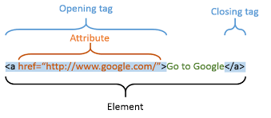

## What is a marquee in HTML?

The `<marquee>` tag in HTML creates a scrolling text or image effect within a webpage. It allows content to move horizontally or vertically across the screen.

  

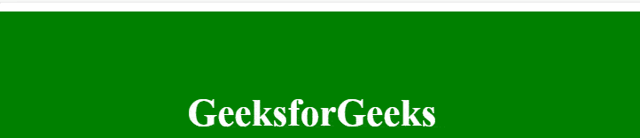  

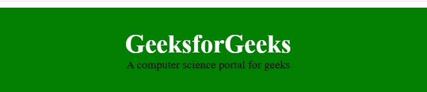

## How do you separate a section of text in HTML?

`<br>` tag – It separates the line of text. It breaks the current line and shifts the flow of the text to a new line.

## Define the list types in HTML.

- Ordered list – displays elements in a numbered format.
- Unordered list –  displays elements in a bulleted format.
- Description list – displays elements in a name–value (term–description) format.

```html
<dl>
  <dt>Coffee</dt>
  <dd>- black hot drink</dd>
  <dt>Milk</dt>
  <dd>- white cold drink</dd>
</dl>
```
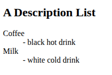

## What is the difference between HTML and CSS?

HTML creates a web page's structure and content, while CSS defines its and styles and layout.

## What are void/empty elements in HTML?

Void elements (also called empty elements) are HTML tags that do not have any content or closing tag.
They are self-closing because they don’t wrap text or other elements inside. 

Common Void/Empty Elements:

```, <input>, <link>, <br>, <hr>```

## What are HTML Entities?

HTML Entities are special codes used to display characters in HTML that otherwise have a reserved meaning in HTML or are not easily typed on a keyboard.

- ```&nbsp(Non-breaking space) - (space) ```  

- ```&copy - © ```

## How do you display a table in an HTML webpage?

- `<table>`
- `<th>`
- `<tr>`
- `<td>`
- `<tbody>`
- `<thead>`
- `<tfooter>`

## Define an image map.

An image map is an image with clickable areas that link to different destinations.

```html


<map name="worldmap">
  <!-- Rectangle area -->
  <area shape="rect" coords="34,44,270,350" href="usa.html">

  <!-- Circle area -->
  <area shape="circle" coords="337,300,44" href="japan.html">

  <!-- Polygon area -->
  <area shape="poly" coords="290,172,333,250,300,300,250,230" href="india.html">
</map>
            
```

## Why do we use a separated style sheet in HTML?

We can link a single style sheet to various web pages, which makes it easier to maintain and change the website's look.

## What is semantic HTML?

Semantic elements = Elements with a meaning. 

A Semantic element clearly describes its meaning to both the browser and the developer.
HTML has several semantic elements that define the different parts of a web page:
```html 
<header>, <nav>, <main>, <footer>, <section> 
```

## What is SVG in HTML?

SVG stands for Scalable Vector Graphics.
It is an XML-based format used to display 2D graphics, shapes, and text directly in HTML.

Unlike normal images (.jpg, .png), SVG does not lose quality when zoomed or resized because it is based on mathematical vectors, not pixels.

## How can you include SVG graphics directly in an HTML document?

```html
<svg width="100" height="100">
  <circle cx="50" cy="50" r="40" stroke="green" stroke-width="4" fill="yellow" />
</svg>
```
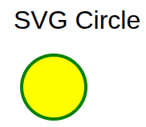

## What is the purpose of the `<canvas>` element in HTML5?
The `<canvas>` element provides a drawable region in the document that can be used to render graphics, such as charts, games, or other visual images, on the fly via scripting (usually JavaScript).

```<canvas id="myCanvas" width="200" height="100"></canvas>```

```html
<!DOCTYPE html>
<html>
<body>

<canvas id="myCanvas" width="200" height="100" style="border:1px solid #d3d3d3;">
Your browser does not support the HTML canvas tag.</canvas>

<script>
var c = document.getElementById("myCanvas");
var ctx = c.getContext("2d");
ctx.beginPath();
ctx.arc(95,50,40,0,2*Math.PI);
ctx.stroke();
</script> 

</body>
</html>
```
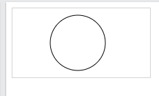


## What is the difference between SVG and Canvas HTML5 elements?
- SVG is vector based and can't get  blurry when zoom. Mostly used for icons, logos, charts, diagrams.
- Canvas is pixel based and can't get  blurry when zoom. Mostly used for games, image editing, real-time graphics, animations.

- SVG can be modified using CSS and scripts.	
- Canvas can only be modified using scripts.

## What is the difference between the ‘id' and ‘class' attributes of HTML elements?

The ‘id' attribute defines a unique identifier for an HTML element, while the ‘class' attribute defines a class for a group of elements. An ‘id' can only be used once on a page, while a ‘class' can be used multiple times.

## What is the difference between HTML and HTML5?
HTML5 is the latest version of HTML and includes new features: 
- Semantic Elements
- Built-in Multimedia Support `<audio> and <video>`
- Canvas and SVG Support
- Form Enhancements with Built-in validation without JavaScript.
    - HTML: Limited input types (text, password, checkbox, etc.).
    - HTML5: email, date, url, range, number, color, etc. 
- Geolocation API
- Support local and session storage

## What is the difference between an absolute and relative URL?
- Absolute: 
  - A link
  - Always points to the same location, no matter where it is used. 
  - `<a href="https://www.example.com/images/photo.jpg">Photo</a>`
    
- Relative
  - local storage path
  - it Depends on the location of the current page.
  - `<a href="images/photo.jpg">Photo</a>` or `./images` or `../images`

## What are the different types of form input fields in HTML?

- text inputs: 
  - text
  - password
  - email
  - url
  - search
- Number Inputs: 
  - number
  - range
- Choice Inputs: 
  - radio 
  - checkbox
  - select
- Buttons: 
  - submit
  - button
  - reset

## What is the difference between “display: none” and “visibility: hidden” 

- Elements with “display: none” are not visible and do not take up any space on the page, means the element are completely remove in the layout
- while elements with “visibility: hidden” are not visible but still take up space, means the element are still in the layout but invisible.

## What is the difference between link tag `<link>` and anchor tag `<a>`?

- link: Used for external resources (like CSS, icons, fonts,  or prefetch files) to the HTML document.
- `<a>`: used for clickable links that navigate to another page, section, or resource.

## When to use scripts in the head and when to use scripts in the body?
- Head
  - For scripts that must run before page content loads, e.g., critical libraries or configuration scripts.
- body 
  - Most common for regular scripts that interact with DOM elements. It Ensures the elements exist before JavaScript manipulates them.

**Modern Alternatives: defer and async**
- defer → Script executes after HTML is fully parsed, keeps order if multiple scripts.
```<script src="script.js" defer></script>```
- async → Script executes as soon as it loads, may run before HTML parsing is finished.
```<script src="script.js" async></script>```

## What are inline and block elements in HTML5?

- Inline elements-Do not start on a new line, take only the width of their content.
```<span>, <a>, , <input>```
- Block elements → Start on a new line, take full width available.
```<div>, <p>, <h1>–<h6>, <section>, <ul>, <ol>, <li>```

##  What is the difference between `<figure>` tag and `` tag?
- `` tag: used to embed just image
- `<figure>` tag: A semantic tag used to embed image with it's content

```html
<figure>
  
  <figcaption>Fig.1 - Trulli, Puglia, Italy.</figcaption>
</figure>
```

##  How can we include audio or video in a webpage?
```html 
<audio controls>
  <source src="audio.mp3" type="audio/mpeg">
  Your browser does not support the audio element.
</audio>

<video width="320" height="240" controls>
  <source src="video.mp4" type="video/mp4">
  Your browser does not support the video tag.
</video>
```

## What are Web Workers?
Web Workers allow you to run JavaScript in the background, separate from the main thread, so your webpage remains responsive while performing heavy tasks.

```js
// main.js
let worker = new Worker("worker.js");
worker.postMessage("Hello Worker");
worker.onmessage = function(e) {
  console.log("Message from worker: " + e.data);
}
```
```js
// worker.js
onmessage = function(e) {
  let result = e.data + " - processed";
  postMessage(result);
}
```

## What are the different approaches to making an image responsive?
- Using the `<picture>` element (for different screen sizes)
```html 
<picture>
  <source media="(max-width: 600px)" srcset="small.jpg">
  <source media="(max-width: 1200px)" srcset="medium.jpg">
  
</picture>
```
- Using CSS width: 100% and height: auto

## What is the Geolocation API in HTML5?
The Geolocation API allows a webpage to get the geographical location (latitude and longitude) of the user’s device.

```html
<button onclick="getLocation()">Show My Location</button>
<p id="demo"></p>

<script>
function getLocation() {
  if (navigator.geolocation) {
    navigator.geolocation.getCurrentPosition(showPosition);
  } else {
    document.getElementById("demo").innerHTML = "Geolocation is not supported.";
  }
}

function showPosition(position) {
  document.getElementById("demo").innerHTML =
  "Latitude: " + position.coords.latitude +
  "<br>Longitude: " + position.coords.longitude;
}
</script>

```

## what is action and method attribute in form

- action → Specifies the URL or path where the form data will be sent when submitted.
```html
<form action="submit.php">
```
- method → Specifies how the form data will be sent to the server. It has two values:
  - GET → Data is sent in the URL (query string). Best for search forms.
  - POST → Data is sent in the request body. Best for sensitive or large data.
## What is the purpose of the `<meta>` tag?

The `<meta>` tag provides metadata about the HTML document, such as character set, author, description, and keywords. It's placed within the `<head>` section.

## How do you create an email link in HTML?

To create a link that opens the user's default email client with a new message, use the mailto: scheme:
```<a href="mailto:example@example.com">Send Email</a>```

## How do you create a checkbox in HTML?

```html
<input type="checkbox" id="vehicle1" value="Bike">
<label for="vehicle1"> I have a bike</label><br>
<input type="checkbox" id="vehicle2" value="Car">
<label for="vehicle2"> I have a car</label><br>
<input type="checkbox" id="vehicle3" value="Boat">
<label for="vehicle3"> I have a boat</label><br>
```
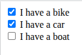

## How do you create a dropdown list in HTML?

```html
<label for="fruits">Choose a fruit:</label>
<select id="fruits" name="fruits">
  <option value="apple">Apple</option>
  <option value="banana">Banana</option>
  <option value="cherry">Cherry</option>
</select>
```
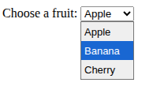

## How do you create a multi-line text input in an HTML form?
```<textarea name="message" rows="4" cols="50"></textarea>```

##  How do you create a hidden input field in an HTML form?
Use `<input type="hidden">` to create a hidden input field that stores data without displaying it to the user:
```<input type="hidden" name="userID" value="12345">```

## What is the purpose of the `<address>` tag in HTML?
The `<address>` tag is used to define contact information for the author or owner of a document or article.

```html
<address>
  Written by John Doe.<br>
  Visit us at:<br>
  Example.com<br>
  Box 564, Disneyland<br>
  USA
</address> 
```


## What are data attributes in HTML, and how are they used?
Data attributes in HTML are custom attributes that start with data- and allow you to store extra information on HTML elements. They are often used to embed custom data that can be accessed via JavaScript.

```html 
<div data-user-id="12345" data-role="admin">User Info</div>
```

```js
const div = document.querySelector('div');
console.log(div.dataset.userId); // Outputs: 12345
console.log(div.dataset.role);   // Outputs: admin
```

## What is the purpose of the rel attribute in a `<link>` tag?

The rel attribute specifies the relationship between the current document and the linked resource. For example, rel="stylesheet" indicates that the linked file is a CSS stylesheet.
```<link rel="stylesheet" href="styles.css">```

## Describe HTML layout structure.
```html
<!DOCTYPE html>
<html>
	<head>
    		<title>Page Title</title>
   	 </head>
<body>	

</body>
</html>
```  
**Explanation:**  
- The ```<!DOCTYPE html>``` declaration defines that this document is an HTML5 document    
- The ```<html>``` element is the root element of an HTML page.
  - Root Element = The root element is the topmost element in a document that contains all the other elements. The ```<html>``` element is the root element because it wraps all the content of the page, including the ```<head>``` and ```<body>``` sections
- The ```<head>``` element in HTML is a container for metadata and links to external resources related to the webpage.  
  - Meta information = Meta information is data about the HTML page that isn’t directly visible to users but helps browsers and search engines understand the page better.  
- The ```<title>``` element specifies a title for the HTML page which is shown the browser’s page’s tab.  
- The ```<body>``` element defines the document’s body and is a container for all the visible contents.

## Is the `<datalist>` tag and `<select>` tag same?
No. The `<datalist>` tag and `<select>` tag are different. In the case of `<select>` tag a user will have to choose from a list of options, whereas `<datalist>` when used along with the `<input>` tag provides a suggestion that the user selects one of the options given or can enter some entirely different value.

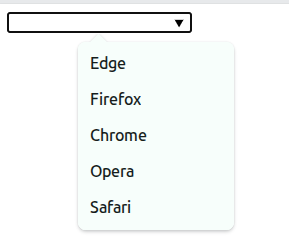

## What is the difference between `<meter` tag and `<progress>` tag?

- `<meter>` → Shows a measurement within a known range (like temperature, disk usage, rating).
  
```Disk usage: <meter value="6" min="0" max="10">6 out of 10</meter>```

- `<progress>` → Shows the progress of a task (like file upload or download).
  
```File upload: <progress value="70" max="100">70%</progress>```


# CSS

##  What is cascading in CSS?

Cascading in CSS refers to the order in which styles are applied to HTML elements when multiple rules could apply. The browser decides which style “wins” based on a set of rules called cascade rules.

The browser determines which CSS rule to apply using three main factors:
- Importance based on cascading order (Inline styles, internal styles, external styles, and !important.)
- specificity
- Source Order (When cascading order and specificity are equal, the later rule in the stylesheet wins.)

## What is CSS, and why is it used?

CSS stands for Cascading Style Sheets. It’s used to control the presentation and layout of HTML elements.

## What are the different ways to apply CSS to a webpage?

 There are three ways of inserting a style sheet:

1. Inline CSS
   
```<h1 style="color: red;">Inline CSS</h1>```

2. Internal CSS
```html
<head>
    <meta charset="UTF-8">
    <meta name="viewport" content="width=device-width, initial-scale=1.0">
    <title>Document</title>
    <style>
        h1{
            color: red;
        }
    </style>
</head>
```
3. External CSS
```html
<head>
    <meta charset="UTF-8">
    <meta name="viewport" content="width=device-width, initial-scale=1.0">
    <title>Document</title>
    <link rel="stylesheet" href="style.css">
</head>
```
```css
h1{
    color: red;
}
```
 
## What are CSS Selectors?

A CSS selector selects the HMTL elements you want to style. We can divide CSS selectors into five categories:
- Simple Selectors (element, id, class, universal, groping selector)
- Combinator Selectors (descendant & child selector)
- Pseudo-class Selectors (:hover, :focus, :nth-child(), :first-child, :checked, :disabled, :visited, :active etc)
- Pseudo-elements Selectors (::before, ::after, ::first-letter, ::first-line etc)
- Attribute selectors ([type=”text”], [target=”_blank”], [class^=”btn-”] etc)

## What are the differences between class and id selectors in CSS?

- Class selector (.classname): Used for multiple elements.

- ID selector (#idname): Used for unique elements, applied to only one element.

## What is CSS box model?

In CSS, the term box model is used when taking about design and layout. The CSS box model is essentially a box that warps around every HTML element. It consists of: content, padding, borders, and margins. The image below illustrates the box model:

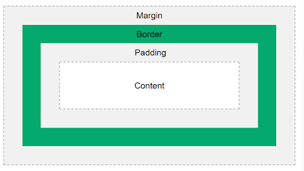

Example 1:


**box-sizing: border-box** 
By default, when we set width and height for an element, only the content inside the element gets that size. However, if we add padding and borders, they increase the total size of the element, often breaking layouts. 

```css
        .div1 {
            width: 300px;
            height: 100px;
            border: 1px solid red;
            margin-bottom: 10px;
        }


        .div2 {
            width: 300px;
            height: 100px;
            border: 1px solid red;
            padding: 25px;
        }
```
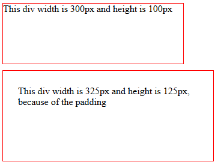

When we apply box-sizing: border-box;, the total width and height include content, padding, and border.

```css
        .div1 {
            width: 300px;
            height: 100px;
            border: 1px solid red;
            margin-bottom: 10px;
            box-sizing: border-box;
        }


        .div2 {
            width: 300px;
            height: 100px;
            border: 1px solid red;
            padding: 25px;
            box-sizing: border-box;
        }
```

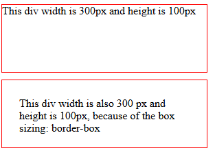

## What is the difference between margin and padding?

<table>
  <tr>
    <th>Margin</th>
    <th>Padding</th>
  </tr>
  <tr>
    <td>margin is the space of outside an element</td>
    <td>Padding is the space inside an element and its border (if any)</td>
  </tr>
  <tr>
    <td>margin Does not increase the element’s size.</td>
    <td>padding Increases the total size of the element (content + padding + border) unless you use box-sizing: border-box.</td>
  </tr>
  <tr>
    <td>Vertical margins can collapse when two margins meet.</td>
    <td>Vertical padding never collapses.</td>
  </tr>
</table>

## What is the difference between display: none and visibility: hidden?

- Elements with “display: none” are not visible and do not take up any space on the page, means the element are completely remove in the layout
- while elements with “visibility: hidden” are not visible but still take up space, means the element are still in the layout but invisible.

## What is Flexbox, what is grid, what is the difference between them? 

- Flexbox (Flexible Box Layout) is a one-dimensional layout system in CSS. It helps arrange items in a row or a column

- CSS Grid is a two-dimensional layout system that allows us to work with both rows and columns at the same time.

## What are media queries in CSS?

Media queries are used to make websites responsive by applying CSS rules based on media types and media features.

- media types: 
  - all → Default, applies to all devices.
  - screen → For screens (monitors, mobiles, tablets).
  - print → For printers.
  - speech → For screen readers.
  
- media features
  - min-width (Mobile first) → Apply styles when the screen is at least this width. That means the styles will work on screens greater than or equal to this width.
  - max-width (Desktop first)→ Apply styles when the screen is at most this width. That means the styles will work on screens less than or equal to this width.
  - min-height / max-height → Similar, but based on height.
  - resolution → Useful for detecting high-DPI (Retina) displays.
  - aspect-ratio → Based on width:height ratio.

## What is the difference between static, relative, absolute, sticky and fixed positioning in CSS?

- static(default):
All elements are static by default. They follow the normal document flow. Thats means top, left, right, bottom have no effect.

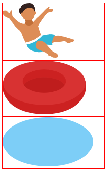

-  Relative:	
When we apply position: relative to an element, it stays in its original position within the document flow but allows us to move it around using properties like top, right, bottom, and left. The element's original space is still reserved, meaning other elements won't shift to take its place.

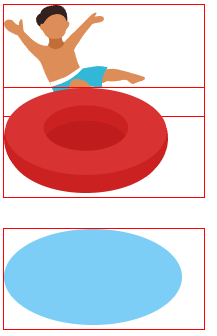

```html
    <div class="swim_container">
        <div class="box boy"></div>
        <div class="box ring"></div>
        <div class="box water"></div>
    </div>
CSS:
.box{
    border: 1px solid red;
    width: 200px;
}
.ring{
    position: relative;
    bottom: 30px;
}
```

- absolute:	
When we apply position: absolute to an element, it is completely removed from its original position in the document flow and is positioned relative to the nearest ancestor that has a non-static position (usually relative, absolute, or fixed).This allows us to move it around freely using properties like top, right, bottom, and left to base on her parent frame. However, since the element is no longer part of the normal flow, its original space is not reserved, causing other elements to shift and fill the gap.


```css
.box{
    border: 1px solid red;
    width: 200px;
}
.ring{
    position: absolute;
    top: 105px;
}

```

-  Sticky:	
The position: sticky property allows an element to “stick” to a specified position within its parent container when scrolling.


```css
.container{
    border: 10px solid goldenrod;
    height: 500px;
    width: 200px;
}
.container2{
    border: 10px solid red;
    height: 500px;
    width: 200px;
}
.box{
    border: 1px solid red;
    width: 200px;
}
.ring{
    position: sticky;
    top: 20px;
}
```

-  Fixed:	

The position: fixed property allows an element to “fixed” to the viewport, not its parent container when scrolling


```css
.container{
    border: 10px solid goldenrod;
    height: 500px;
    width: 200px;
}
.container2{
    border: 10px solid red;
    height: 500px;
    width: 200px;
}
.box{
    border: 1px solid red;
    width: 200px;
}
.ring{
    position: fixed;
    top: 20px;
}
```


## When to use relative and absolute?

when you need to move freely a child element based on a parent element. 

```css
.card {
  position: relative; /* parent element acts as reference for child */
}

.badge {
  position: absolute; /* child can be moved freely within parent */
  top: 10px;
  right: 10px; 
}

```

## What is the z-index in CSS?

z-index controls the stacking order of elements based on their value:

- A lower value means the element is stacked toward the bottom.

- A higher value means the element is stacked on top of other elements.

```html
        <style>
        .box{
            position: absolute;
        }
        .boy{
            z-index: 3;
        }
        .ring{
            z-index: 2;
            top: 45px;
        }
        .water{
            z-index: 1;
            top: 60px;
        }
        </style>

    <div>
        <div class="box boy"></div>
        <div class="box ring"></div>
        <div class="box water"></div>
    </div>
```


## How is CSS different from CSS3?

<table>
  <tr>
    <th>CSS</th>
    <th>CSS3</>
  </tr>
  <tr>
    <td>It is non-modular, meaning all styling rules are part of a single standard. If we update one rule, it can affect the whole style.</td>
    <td>It is modular, divided into separate modules like Flexbox, Grid, Transitions, Animations, and Media Queries. Each module can be used and updated independently without affecting the others.</td>
  </tr>
  <tr>
    <td>Dont support Flexbox, Grid, Transitions, Transforms, Animations, and Media Queries, text-shadow, Multiple Backgrounds, Variables, box-model, gradient, border-radius, box-shadow</td>
    <td>support Flexbox, Grid, Transitions, Transforms, Animations, and Media Queries, text-shadow, Multiple Backgrounds, Variables, box-model, gradient, border-radius, box-shadow</td>
  </tr>
  <tr>
    <td>Only support basic selectors (element (p), class (.class), ID (#id), descendant (div p), child (div > p))</td>
    <td>Supports advanced selectors: combinator selectors, pseudo-class selectors (:hover, :first-child), pseudo-element selectors (::before, ::after), attribute selectors ([type="text"]),</td>
  </tr>
</table>

## what is tailwind css and bootstrap?
- Tailwind CSS is a utility-first CSS framework. means instead of writing custom CSS, you apply pre-defined utility classes directly in HTML.

```html
<button class="bg-blue-500 text-white px-4 py-2 rounded hover:bg-blue-700">
  Click Me
</button>
```
- Bootstrap is a component-based CSS framework. means It provides pre-built components like buttons, navbars, modals, and forms.

```html
<button class="btn btn-primary">
  Click Me
</button>
```
Note: If you use Tailwind CSS with DaisyUI, you get the ready-made component power like Bootstrap while keeping the flexibility and customization of Tailwind.

```html
<!-- Tailwind + DaisyUi -->
<button class="btn btn-primary text-red-500 rounded-2xl">
  Click Me
</button>
```

## what is the syntax for css?

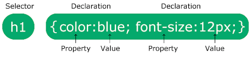


##  what is cascading order and specificity?

**Cascading Order** 
The cascading order determines which style sheet apply to the html based on priority/importance.
- 1st priority = Inline CSS
- 2nd priority = Internal CSS
- 3rd priority = External CSS

**Specificity**
If there are two or more CSS rules that point to the same element, the selector with the highest specificity will win, and its style declaration will be applied to that HTML element.

- 1st priority = Inline CSS
- 2nd priority = Id selector (#navbar, #hero-section)
- 3rd priority = Classes and pseudo-classes selector (.test, :hover)
- 4th priority = Elements and pseudo-elements selector (h1, ::before, ::after)

## What is !important?
The !important rule is used to give highest priority to a CSS property, overriding normal specificity and cascade rules.Even if another rule has higher specificity, the one with !important will win (unless the other one also has !important).

```css
p {
  color: blue !important;  /* this wins */
}

p {
  color: red; /* this is ignored */
}
```

## When is it better to use logical properties vs physical properties?

- Use physical properties for fixed layouts where direction is always the same.
- Use logical properties(block-start, block-end, inline-start, inline-end etc) for internationalized layouts.

##  What are CSS custom properties (variables)?

A CSS variable (also called a custom property) is a reusable value that you define once and use multiple times in your CSS. CSS variables are usually defined inside the :root selector so that they are available globally.

```css
:root{
    --main-color: blue:
    --main-font: 20px; 
}

body{
    background-color: var(--main-color);
    font-size: var(--main-font);
}
```

## What’s the difference between a CSS reset and a normalizer

- css reset removes all default browser styles
- normalizer preserves useful default styles and makes them consistent across different browsers.

```css
* {
  margin: 0;
  padding: 0;
  box-sizing: border-box;
}
```   

```css
/* Normalize.css */
html {
  line-height: 1.15;
  -webkit-text-size-adjust: 100%;
}
```
## how many css color available?

- Named color --> red
- Hex color --> #ff0000; (red)
- RGB color --> rgb(255, 0, 0); (red)
- RGBA color --> rgba(255, 0, 0, 0.5); (red with alpha (opacity) value (0–1))
- HSL color --> hsl(0, 100%, 50%); (red)
- HSLA color --> hsla(0, 100%, 50%, 0.5); (red with alpha (opacity) value (0–1))

## What is the difference between CSS border and outline?

- A border is a line drawn around the element’s
- An outline is a line drawn around the border.

## What are the different CSS link states?

- a:link – a normal link, unvisited (underline and blue)
- a:visited – a link the user has visited (underlined and purple)
- a:hover – a link when the user mouse over it
- a:active – a link the moment it is clicked (underlined and red)

## What is CSS overflow?

The CSS overflow property controls what happens to content that is too big to fit into an area. The overflow property only works for block elements with a specified height. 

The overflow property has the following values:

- visible(default)

  

- hidden
  
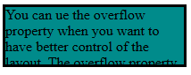    

- scroll 
  
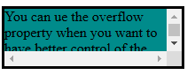  

- auto (Similar to scroll, but it adds scroll bars only when necessary)

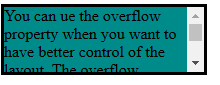

- overflow-x and overflow-y

```css
     div {
            background-color: darkcyan;
            width: 200px;
            height: 65px;
            border: 3px solid black;
            overflow-x: hidden;
            overflow-y: scroll;
        }
```


## What does the CSS float property do?
The float property in CSS is used to position an element to the left or right of its container

## What are different display properties
- inline --> Element takes only as much width as content, stays in the same line.
- block --> Element takes full width, starts on a new line.
- inline-block --> Behaves like inline but can have width and height.
- none --> Element is hidden and removed from the layout.

```html
<!DOCTYPE html>
<html lang="en">


<head>
    <style>
        .inline {
            display: inline;
            background-color: lightblue;
            padding: 5px;
        }


        .block {
            display: block;
            background-color: lightgreen;
            padding: 10px;
            margin: 5px 0;
        }


        .inline-block {
            display: inline-block;
            background-color: lightcoral;
            padding: 10px;
            margin: 5px;
        }


        .none {
            display: none;
        }


        .container {
            border: 1px solid #000;
            padding: 10px;
        }
    </style>
</head>


<body>
    <div class="inline">This is inline</div>
    <div class="inline">Another inline</div>


    <span class="block">This is block</span>
    <span class="block">Another block</span>


    <div class="inline-block">This is inline-block</div>
    <div class="inline-block">Another inline-block</div>


    <div class="none">You can't see me (display: none)</div>
</body>


</html>
```

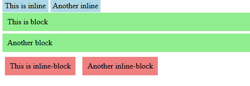

## How can we center an element in CSS?
**with justify-content and align-items**

```css
.flex-container{
    background-color: dodgerblue;
    height: 600px;
    display: flex;
    justify-content: center;
    align-items: center;
}
.flex-container > div{
    background-color: whitesmoke;
    width: 100px;
    line-height: 75px;
    margin: 10px;
    text-align: center;
    font-size: 30px;
}
```

```html
    <div class="flex-container">
        <div>1</div>
    </div>
```

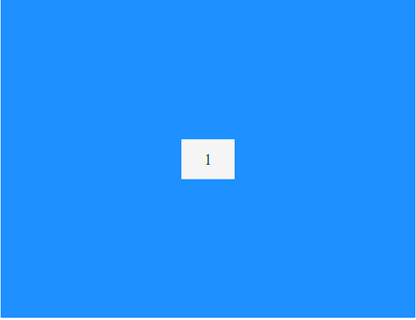

**with margin: auto;**

```css
.flex-container{
    background-color: dodgerblue;
    height: 600px;
    display: flex;
    /* justify-content: center;
    align-items: center; */
}
.child{
    background-color: whitesmoke;
    width: 100px;
    line-height: 75px; 
    margin: 10px;
    text-align: center;
    font-size: 30px;
    margin: auto; /*magic*/
}
```

```html
    <div class="flex-container">
        <div class="child">1</div>
    </div>
```


## How can we add gradients in CSS?
- Linear Gradient --> background: linear-gradient(direction, color1, color2.... );

  

- Radial Gradient --> background: radial-gradient(cirle, color1, color2.... ); 

  


- Conic Gradient --> background: conic-gradient(color1, color1, color2.... ); 

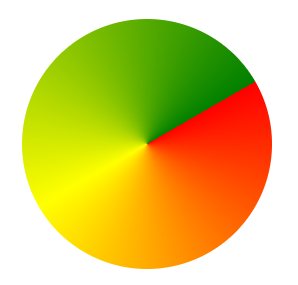  

##  How can we make our website responsive using CSS?

- to use relative units (%, em, rem, vh, vw) instead of fixed pixels.
- to use Media Queries
- to make Flexible Images & Videos
- to Use flexbox and grid for flexible layouts
- to follow Mobile-First Design

## What is @import in CSS?
The @import rule is used to include external CSS files inside a CSS file.

```css
/* main.css */
@import url("reset.css");   /* importing reset styles */
@import url("theme.css");   /* importing theme styles */

body {
  font-family: Arial, sans-serif;
}
```

**note:** @import is slower than `<link>` because it makes extra HTTP requests.

## How @import makes extra HTTP requests?

```css
/* main.css */
@import url("reset.css");   /* importing reset styles */
@import url("theme.css");   /* importing theme styles */
```

Process:
- Step 1: Browser loads main.css.
- Step 2: Sees @import, then requests reset.css.
- Step 3: Sees another @import, then requests theme.css.

Total 3 requests (1 + 1 + 1), loaded sequentially.

```html
<!-- Using <link> -->
<link rel="stylesheet" href="reset.css">
<link rel="stylesheet" href="theme.css">
<link rel="stylesheet" href="main.css">
```

Process:
- Browser requests all 3 files at once, in parallel

## Tell us about the general CSS nomenclature.

CSS nomenclature refers to the conventions and naming patterns used for CSS selectors, classes, and IDs to make styles readable, maintainable, and scalable.


## what is Sass and SCSS 

- Sass (Syntactically Awesome Stylesheets) is a preprocessor scripting language that extends CSS with features like variables, conditions, functions, loops, nesting, mixins and modular imports, making stylesheets more maintainable, reusable, and scalable.

- SCSS is a syntax of Sass that is fully compatible with CSS, using {} and ; like regular CSS, while retaining all Sass features.

**SCSS features:** 
- variables: 
  
```css
$primary-color: #3498db;
$font-stack: Arial, sans-serif;

body {
  color: $primary-color;
  font-family: $font-stack;
}
``` 
- conditions

```css
$theme: dark;

body {
  @if $theme == light {
    background-color: #ffffff;
    color: #000000;
  } @else if $theme == dark {
    background-color: #2c3e50;
    color: #ecf0f1;
  } @else {
    background-color: #f0f0f0;
    color: #333333;
  }
}
```

- functions

```css
@function divide($a, $b) {
  @return $a / $b * 100%;
}

.box {
  width: divide(1, 3); // 33.333%
}
```
- loops

```css
@for $i from 1 through 3 {
  .col-#{$i} {
    width: 100% / 3 * $i;
  }
}
```

- nesting:

```css
nav ul li a {
  color: #3498db; 
  text-decoration: none;
}

nav ul li a:hover {
  color: #2a81c4; 
}
```

with scss

```css
nav {
  ul {
    li {
      a {
        color: $primary-color;
        text-decoration: none;

        &:hover {
          color: darken($primary-color, 10%);
        }
      }
    }
  }
}
```
- Mixins

```css
@mixin flex-center {
  display: flex;
  justify-content: center;
  align-items: center;
}

.container {
  @include flex-center;
  height: 100vh;
}
```

- modular imports

```css
// _variables.scss
$primary-color: #3498db;

// _mixins.scss
@mixin flex-center {
  display: flex;
  justify-content: center;
  align-items: center;
}

// main.scss
@import 'variables';
@import 'mixins';

.container {
  @include flex-center;
  color: $primary-color;
}
```

**Popular CSS Preprocessors**
- Sass/SCSS
- less
- Stylus

## Difference Between Sass and SCSS

| Sass                                                       | SCSS                                                                     |
| ---------------------------------------------------------- | ------------------------------------------------------------------------ |
| no {} or ;                                                 | CSS-like syntax with {} and ;                                            |
| Not fully CSS-compatible                                   | Not fully CSS-compatible                                                 |
| .sass                                                      | .scss                                                                    |
| Cleaner for small projects or those who prefer indentation | More popular for larger projects because it’s easier to migrate from CSS |

##  what is scripting language and why sass is called a scripting language 

- scripting language are interpreted pieces of code designed to run in the browser without compiling the entire program  
  
Note: Interpreting: Is a process where the JS engine executes the bytecode step-by-step using an interpreter. 

- Sass adds programming-like features to CSS, such as Variables, Functions, Loops (@for, @each), Conditionals (@if, @else). These features let you write dynamic, reusable, and logical CSS, which is why Sass is considered a scripting language.

## what is preprocessor and why sass call preprocessor

- A preprocessor is a tool that takes one type of code, processes it, and outputs another type.

- Sass is called a preprocessor because Sass itself is the preprocessor, and it comes with a compiler that converts .sass or .scss files into standard .css.


##  How does Calc work?

The calc() function in CSS allows you to perform calculations by (+ , -, / *) to determine property values dynamically. You can mix different units like px, %, em, rem, vh, vw, etc.

```css
.container {
  width: calc(100% - 50px); /* container width is full width minus 50px */
}
```


# JavaScript

# React.js

# Firebase
## What is Firebase
## Is firebase frontend or backend
## What is firebase architecture
## What is the features of firebase 
## Difference between firebase and Mongodb
## Authentication vs Authorization
- Authentication = Verify who you are
- Authorization = check what can you do
## Can you tell me names of 3 authentication methods 
## what is OAuth 2.0 and how it is worked 
## How firebase authentication works

# Node.js
# Express.js
# MongoDB
# TypeScript
# Next.js