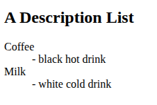
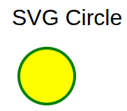
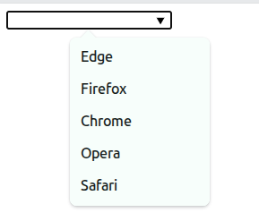
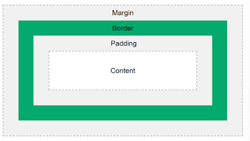
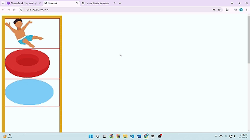
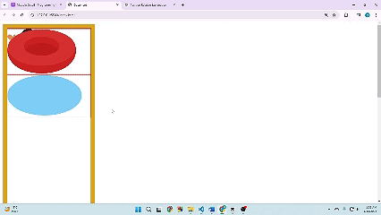
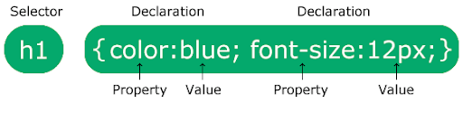
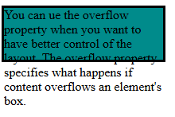
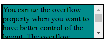

<h1 align="center">Interview Questions</h1>

<details>
<summary>Click for table of contents</summary>

### Table of contents
- [HTML](#html)
  - [What is HTML?](#what-is-html)
  - [Difference between element, attribute and tag?](#difference-between-element-attribute-and-tag)
  - [What is a marquee in HTML?](#what-is-a-marquee-in-html)
  - [How do you separate a section of text in HTML?](#how-do-you-separate-a-section-of-text-in-html)
  - [Define the list types in HTML.](#define-the-list-types-in-html)
  - [What is the difference between HTML and CSS?](#what-is-the-difference-between-html-and-css)
  - [What are void/empty elements in HTML?](#what-are-voidempty-elements-in-html)
  - [What are HTML Entities?](#what-are-html-entities)
  - [How do you display a table in an HTML webpage?](#how-do-you-display-a-table-in-an-html-webpage)
  - [Define an image map.](#define-an-image-map)
  - [Why do we use a separated style sheet in HTML?](#why-do-we-use-a-separated-style-sheet-in-html)
  - [What is semantic HTML?](#what-is-semantic-html)
  - [What is SVG in HTML?](#what-is-svg-in-html)
  - [How can you include SVG graphics directly in an HTML document?](#how-can-you-include-svg-graphics-directly-in-an-html-document)
  - [What is the purpose of the `<canvas>` element in HTML5?](#what-is-the-purpose-of-the-canvas-element-in-html5)
  - [What is the difference between SVG and Canvas HTML5 elements?](#what-is-the-difference-between-svg-and-canvas-html5-elements)
  - [What is the difference between the ‘id' and ‘class' attributes of HTML elements?](#what-is-the-difference-between-the-id-and-class-attributes-of-html-elements)
  - [What is the difference between HTML and HTML5?](#what-is-the-difference-between-html-and-html5)
  - [What is the difference between an absolute and relative URL?](#what-is-the-difference-between-an-absolute-and-relative-url)
  - [What are the different types of form input fields in HTML?](#what-are-the-different-types-of-form-input-fields-in-html)
  - [What is the difference between “display: none” and “visibility: hidden”](#what-is-the-difference-between-display-none-and-visibility-hidden)
  - [What is the difference between link tag `<link>` and anchor tag `<a>`?](#what-is-the-difference-between-link-tag-link-and-anchor-tag-a)
  - [When to use scripts in the head and when to use scripts in the body?](#when-to-use-scripts-in-the-head-and-when-to-use-scripts-in-the-body)
  - [What are inline and block elements in HTML5?](#what-are-inline-and-block-elements-in-html5)
  - [What is the difference between `<figure>` tag and `` tag?](#what-is-the-difference-between-figure-tag-and-img-tag)
  - [How can we include audio or video in a webpage?](#how-can-we-include-audio-or-video-in-a-webpage)
  - [What are Web Workers?](#what-are-web-workers)
  - [What are the different approaches to making an image responsive?](#what-are-the-different-approaches-to-making-an-image-responsive)
  - [What is the Geolocation API in HTML5?](#what-is-the-geolocation-api-in-html5)
  - [what is action and method attribute in form](#what-is-action-and-method-attribute-in-form)
  - [What is the purpose of the `<meta>` tag?](#what-is-the-purpose-of-the-meta-tag)
  - [How do you create an email link in HTML?](#how-do-you-create-an-email-link-in-html)
  - [How do you create a checkbox in HTML?](#how-do-you-create-a-checkbox-in-html)
  - [How do you create a dropdown list in HTML?](#how-do-you-create-a-dropdown-list-in-html)
  - [How do you create a multi-line text input in an HTML form?](#how-do-you-create-a-multi-line-text-input-in-an-html-form)
  - [How do you create a hidden input field in an HTML form?](#how-do-you-create-a-hidden-input-field-in-an-html-form)
  - [What is the purpose of the `<address>` tag in HTML?](#what-is-the-purpose-of-the-address-tag-in-html)
  - [What are data attributes in HTML, and how are they used?](#what-are-data-attributes-in-html-and-how-are-they-used)
  - [What is the purpose of the rel attribute in a `<link>` tag?](#what-is-the-purpose-of-the-rel-attribute-in-a-link-tag)
  - [Describe HTML layout structure.](#describe-html-layout-structure)
  - [Is the `<datalist>` tag and `<select>` tag same?](#is-the-datalist-tag-and-select-tag-same)
  - [What is the difference between `<meter` tag and `<progress>` tag?](#what-is-the-difference-between-meter-tag-and-progress-tag)
- [CSS](#css)
  - [What is cascading in CSS?](#what-is-cascading-in-css)
  - [What is CSS, and why is it used?](#what-is-css-and-why-is-it-used)
  - [What are the different ways to apply CSS to a webpage?](#what-are-the-different-ways-to-apply-css-to-a-webpage)
  - [What are CSS Selectors?](#what-are-css-selectors)
  - [What are the differences between class and id selectors in CSS?](#what-are-the-differences-between-class-and-id-selectors-in-css)
  - [What is CSS box model?](#what-is-css-box-model)
  - [What is the difference between margin and padding?](#what-is-the-difference-between-margin-and-padding)
  - [What is the difference between display: none and visibility: hidden?](#what-is-the-difference-between-display-none-and-visibility-hidden-1)
  - [What is Flexbox, what is grid, what is the difference between them?](#what-is-flexbox-what-is-grid-what-is-the-difference-between-them)
  - [What are media queries in CSS?](#what-are-media-queries-in-css)
  - [What is the difference between static, relative, absolute, sticky and fixed positioning in CSS?](#what-is-the-difference-between-static-relative-absolute-sticky-and-fixed-positioning-in-css)
  - [When to use relative and absolute?](#when-to-use-relative-and-absolute)
  - [What is the z-index in CSS?](#what-is-the-z-index-in-css)
  - [How is CSS different from CSS3?](#how-is-css-different-from-css3)
  - [what is tailwind css and bootstrap?](#what-is-tailwind-css-and-bootstrap)
  - [what is the syntax for css?](#what-is-the-syntax-for-css)
  - [what is cascading order and specificity?](#what-is-cascading-order-and-specificity)
  - [What is !important?](#what-is-important)
  - [When is it better to use logical properties vs physical properties?](#when-is-it-better-to-use-logical-properties-vs-physical-properties)
  - [What are CSS custom properties (variables)?](#what-are-css-custom-properties-variables)
  - [What’s the difference between a CSS reset and a normalizer](#whats-the-difference-between-a-css-reset-and-a-normalizer)
  - [how many css color available?](#how-many-css-color-available)
  - [What is the difference between CSS border and outline?](#what-is-the-difference-between-css-border-and-outline)
  - [What are the different CSS link states?](#what-are-the-different-css-link-states)
  - [What is CSS overflow?](#what-is-css-overflow)
  - [What does the CSS float property do?](#what-does-the-css-float-property-do)
  - [What are different display properties](#what-are-different-display-properties)
  - [How can we center an element in CSS?](#how-can-we-center-an-element-in-css)
  - [How can we add gradients in CSS?](#how-can-we-add-gradients-in-css)
  - [How can we make our website responsive using CSS?](#how-can-we-make-our-website-responsive-using-css)
  - [What is @import in CSS?](#what-is-import-in-css)
  - [How @import makes extra HTTP requests?](#how-import-makes-extra-http-requests)
  - [Tell us about the general CSS nomenclature.](#tell-us-about-the-general-css-nomenclature)
  - [what is Sass and SCSS](#what-is-sass-and-scss)
  - [Difference Between Sass and SCSS](#difference-between-sass-and-scss)
  - [what is scripting language and why sass is called a scripting language](#what-is-scripting-language-and-why-sass-is-called-a-scripting-language)
  - [what is preprocessor and why sass call preprocessor](#what-is-preprocessor-and-why-sass-call-preprocessor)
  - [How does Calc work?](#how-does-calc-work)
- [JavaScript](#javascript)
  - [Theory Based:](#theory-based)
    - [What are closure in JavaScript? (important):](#what-are-closure-in-javascript-important)
    - [What is callback function? (important):](#what-is-callback-function-important)
    - [What is callback hell? (important):](#what-is-callback-hell-important)
    - [What is Event Flow? (important):](#what-is-event-flow-important)
    - [what is Event Delegation? (important):](#what-is-event-delegation-important)
    - [What is the use of useCapture parameter and stopPropagation method? (important):](#what-is-the-use-of-usecapture-parameter-and-stoppropagation-method-important)
    - [What is Web API? (important):](#what-is-web-api-important)
    - [What is Event loop? (important):](#what-is-event-loop-important)
    - [What is this keyword? (important):](#what-is-this-keyword-important)
    - [What is a prototype, prototype Chain and prototype inheritance in js? (important):](#what-is-a-prototype-prototype-chain-and-prototype-inheritance-in-js-important)
    - [What is the difference between __proto__ and prototype property? (important):](#what-is-the-difference-between-proto-and-prototype-property-important)
    - [Difference between class inheritance and prototype inheritance? (important):](#difference-between-class-inheritance-and-prototype-inheritance-important)
    - [pros and cons of functional programming vs object-oriented programming?](#pros-and-cons-of-functional-programming-vs-object-oriented-programming)
    - [What is Call Stack:](#what-is-call-stack)
    - [what is Scope Chain](#what-is-scope-chain)
    - [What is JSON and its common operations:](#what-is-json-and-its-common-operations)
    - [What is the difference between splice()/slice() and split()/join():](#what-is-the-difference-between-spliceslice-and-splitjoin)
    - [How do you compare array/set and  Object/Map:](#how-do-you-compare-arrayset-and--objectmap)
    - [What is the difference between == and === operators:](#what-is-the-difference-between--and--operators)
    - [Difference Between Arrow Function and Normal Function:](#difference-between-arrow-function-and-normal-function)
    - [What is a first class function, What is a first order function, What is a higher order function, What is a unary function, What is the currying function, What is a pure function, what is IIFE](#what-is-a-first-class-function-what-is-a-first-order-function-what-is-a-higher-order-function-what-is-a-unary-function-what-is-the-currying-function-what-is-a-pure-function-what-is-iife)
    - [What is the difference between let and var and const:](#what-is-the-difference-between-let-and-var-and-const)
    - [What is TDZ:](#what-is-tdz)
    - [what is Hoisting:](#what-is-hoisting)
    - [What is scope in javascript:](#what-is-scope-in-javascript)
    - [What is Cookie, Local Storage and Session Storage:](#what-is-cookie-local-storage-and-session-storage)
    - [Difference between Cookie, local storage and session storage:](#difference-between-cookie-local-storage-and-session-storage)
    - [What is Promise:](#what-is-promise)
    - [What is a strict mode in javascript:](#what-is-a-strict-mode-in-javascript)
    - [Difference between null and undefined:](#difference-between-null-and-undefined)
    - [What's the difference between undefined and not defined in JavaScript:](#whats-the-difference-between-undefined-and-not-defined-in-javascript)
    - [Explain NaN and how to check for it:](#explain-nan-and-how-to-check-for-it)
    - [What is event:](#what-is-event)
    - [What are main ES6 features:](#what-are-main-es6-features)
    - [What is Programming Paradigm:](#what-is-programming-paradigm)
    - [What is truthy and falsy values:](#what-is-truthy-and-falsy-values)
    - [What is babel:](#what-is-babel)
    - [Explain call(), apply(), and bind() with examples:](#explain-call-apply-and-bind-with-examples)
    - [What is the arguments object in functions:](#what-is-the-arguments-object-in-functions)
    - [Explain default parameters in ES6:](#explain-default-parameters-in-es6)
    - [Difference between function declaration and function expression:](#difference-between-function-declaration-and-function-expression)
    - [What is Memoization:](#what-is-memoization)
    - [Explain async/await syntax:](#explain-asyncawait-syntax)
    - [Explain setTimeout() vs setInterval():](#explain-settimeout-vs-setinterval)
    - [difference between microtasks and macrotasks:](#difference-between-microtasks-and-macrotasks)
    - [what is shallow copy and deep copy:](#what-is-shallow-copy-and-deep-copy)
    - [Explain Object.freeze() vs Object.seal():](#explain-objectfreeze-vs-objectseal)
    - [What is service workers and web workers:](#what-is-service-workers-and-web-workers)
    - [What is debouncing and throttling?](#what-is-debouncing-and-throttling)
    - [What is memory leak and how does JavaScript handle memory leak?](#what-is-memory-leak-and-how-does-javascript-handle-memory-leak)
    - [How to empty an array in JavaScript?](#how-to-empty-an-array-in-javascript)
    - [How to check if an object is an array or not?](#how-to-check-if-an-object-is-an-array-or-not)
    - [How to check whether a key exist in a JavaScript object or not.](#how-to-check-whether-a-key-exist-in-a-javascript-object-or-not)
    - [What’s the difference between typeof and instanceof?](#whats-the-difference-between-typeof-and-instanceof)
    - [Difference between Function, Method and Constructor calls in JavaScript.](#difference-between-function-method-and-constructor-calls-in-javascript)
    - [How to merge two JavaScript Object dynamically](#how-to-merge-two-javascript-object-dynamically)
    - [What is non-enumerable property in JavaScript and how you can create one?](#what-is-non-enumerable-property-in-javascript-and-how-you-can-create-one)
    - [What is Function binding ?](#what-is-function-binding-)
    - [Differences between CommonJS modules and ES modules in JavaScript](#differences-between-commonjs-modules-and-es-modules-in-javascript)
    - [Difference between mutable and immutable objects in JavaScript:](#difference-between-mutable-and-immutable-objects-in-javascript)
    - [How does JavaScript garbage collection work:](#how-does-javascript-garbage-collection-work)
  - [Coding Exercise:](#coding-exercise)
  - [problem solving:](#problem-solving)
    - [Write a program to reverse a string / find palindrome](#write-a-program-to-reverse-a-string--find-palindrome)
    - [Write a program to reverse a string by words.](#write-a-program-to-reverse-a-string-by-words)
    - [Write a program to reverse a given integer number](#write-a-program-to-reverse-a-given-integer-number)
    - [Write a function which can convert the time input given in 12 hours format to 24 hours format](#write-a-function-which-can-convert-the-time-input-given-in-12-hours-format-to-24-hours-format)
    - [Write a function which accepts a string argument and returns the count of characters between the first and last character 'X'](#write-a-function-which-accepts-a-string-argument-and-returns-the-count-of-characters-between-the-first-and-last-character-x)
    - [Write a function to truncate a string to a certain number of letters / number of words](#write-a-function-to-truncate-a-string-to-a-certain-number-of-letters--number-of-words)
    - [Create a regular expression to validate if the given input is valid mobile number or not](#create-a-regular-expression-to-validate-if-the-given-input-is-valid-mobile-number-or-not)
    - [Write a function which returns a list of elements which contains at least one character as digit](#write-a-function-which-returns-a-list-of-elements-which-contains-at-least-one-character-as-digit)
    - [Write a function which checks if a given search text is present either in the beginning of the first name or the second name](#write-a-function-which-checks-if-a-given-search-text-is-present-either-in-the-beginning-of-the-first-name-or-the-second-name)
    - [Write a function to chop a string into chunks of a given length and return it as array](#write-a-function-to-chop-a-string-into-chunks-of-a-given-length-and-return-it-as-array)
    - [Write a code to remove all the vowels from a given string](#write-a-code-to-remove-all-the-vowels-from-a-given-string)
    - [Create a function which returns random hex color code](#create-a-function-which-returns-random-hex-color-code)
    - [Swap two integers variables without using a temporary variable:](#swap-two-integers-variables-without-using-a-temporary-variable)

</details>

---
---

# HTML

##  What is HTML? 

HTML is the standard markup language for creating web pages. Its element tells the browser how to display the content.  

HTML stands for = Hyper Text Markup Language  

Hyper Text = Hyper Text is text with clickable links that take you one page to other pages or different parts of the same page.  

Markup Language = Markup Language is a way to write text using special tags and rules that tell a browser how to organize and display the content.
So Instead of focusing on the behavior or logic like programming languages do, markup languages describe how content should be displayed or formatted.
example: 
- HTML: Used to create web pages.
```
<!DOCTYPE html>
<html>
  <head>
    <title>My Web Page</title>
  </head>
  <body>
    <h1>Welcome to My Website</h1>
    <p>This is a paragraph of text.</p>
  </body>
</html>
```
- XHTML: Similar to HTML but stricter with rules (all tags must be closed, lowercase).
```
<?xml version="1.0" encoding="UTF-8"?>
<!DOCTYPE html PUBLIC "-//W3C//DTD XHTML 1.0 Strict//EN"
  "http://www.w3.org/TR/xhtml1/DTD/xhtml1-strict.dtd">
<html xmlns="http://www.w3.org/1999/xhtml">
  <head>
    <title>My XHTML Page</title>
  </head>
  <body>
    <h1>Welcome to My XHTML Website</h1>
    <p>This is a paragraph of text.</p>
  </body>
</html>
```
- XML: Used for storing and transporting data.
```
<book>
  <title>Learning XML</title>
  <author>John Doe</author>
  <year>2025</year>
</book>
```
- Markdown: Used for formatting text simply, often in documentation like github readme.md files.
```
# Welcome to My Markdown Page

This is a paragraph of text.

- Item 1
- Item 2
- Item 3

**This text is bold**  
*This text is italic*
```

## Difference between element, attribute and tag?


## What is a marquee in HTML?

The `<marquee>` tag in HTML creates a scrolling text or image effect within a webpage. It allows content to move horizontally or vertically across the screen.

  

  


## How do you separate a section of text in HTML?

`<br>` tag – It separates the line of text. It breaks the current line and shifts the flow of the text to a new line.

## Define the list types in HTML.

- Ordered list – displays elements in a numbered format.
- Unordered list –  displays elements in a bulleted format.
- Description list – displays elements in a name–value (term–description) format.

```html
<dl>
  <dt>Coffee</dt>
  <dd>- black hot drink</dd>
  <dt>Milk</dt>
  <dd>- white cold drink</dd>
</dl>
```


## What is the difference between HTML and CSS?

HTML creates a web page's structure and content, while CSS defines its and styles and layout.

## What are void/empty elements in HTML?

Void elements (also called empty elements) are HTML tags that do not have any content or closing tag.
They are self-closing because they don’t wrap text or other elements inside. 

Common Void/Empty Elements:

```, <input>, <link>, <br>, <hr>```

## What are HTML Entities?

HTML Entities are special codes used to display characters in HTML that otherwise have a reserved meaning in HTML or are not easily typed on a keyboard.

- ```&nbsp(Non-breaking space) - (space) ```  

- ```&copy - © ```

## How do you display a table in an HTML webpage?

- `<table>`
- `<th>`
- `<tr>`
- `<td>`
- `<tbody>`
- `<thead>`
- `<tfooter>`

## Define an image map.

An image map is an image with clickable areas that link to different destinations.

```html


<map name="worldmap">
  <!-- Rectangle area -->
  <area shape="rect" coords="34,44,270,350" href="usa.html">

  <!-- Circle area -->
  <area shape="circle" coords="337,300,44" href="japan.html">

  <!-- Polygon area -->
  <area shape="poly" coords="290,172,333,250,300,300,250,230" href="india.html">
</map>
            
```

## Why do we use a separated style sheet in HTML?

We can link a single style sheet to various web pages, which makes it easier to maintain and change the website's look.

## What is semantic HTML?

Semantic elements = Elements with a meaning. 

A Semantic element clearly describes its meaning to both the browser and the developer.
HTML has several semantic elements that define the different parts of a web page:
```html 
<header>, <nav>, <main>, <footer>, <section> 
```

## What is SVG in HTML?

SVG stands for Scalable Vector Graphics.
It is an XML-based format used to display 2D graphics, shapes, and text directly in HTML.

Unlike normal images (.jpg, .png), SVG does not lose quality when zoomed or resized because it is based on mathematical vectors, not pixels.

## How can you include SVG graphics directly in an HTML document?

```html
<svg width="100" height="100">
  <circle cx="50" cy="50" r="40" stroke="green" stroke-width="4" fill="yellow" />
</svg>
```


## What is the purpose of the `<canvas>` element in HTML5?
The `<canvas>` element provides a drawable region in the document that can be used to render graphics, such as charts, games, or other visual images, on the fly via scripting (usually JavaScript).

```<canvas id="myCanvas" width="200" height="100"></canvas>```

```html
<!DOCTYPE html>
<html>
<body>

<canvas id="myCanvas" width="200" height="100" style="border:1px solid #d3d3d3;">
Your browser does not support the HTML canvas tag.</canvas>

<script>
var c = document.getElementById("myCanvas");
var ctx = c.getContext("2d");
ctx.beginPath();
ctx.arc(95,50,40,0,2*Math.PI);
ctx.stroke();
</script> 

</body>
</html>
```


## What is the difference between SVG and Canvas HTML5 elements?
- SVG is vector based and can't get  blurry when zoom. Mostly used for icons, logos, charts, diagrams.
- Canvas is pixel based and can't get  blurry when zoom. Mostly used for games, image editing, real-time graphics, animations.

- SVG can be modified using CSS and scripts.	
- Canvas can only be modified using scripts.

## What is the difference between the ‘id' and ‘class' attributes of HTML elements?

The ‘id' attribute defines a unique identifier for an HTML element, while the ‘class' attribute defines a class for a group of elements. An ‘id' can only be used once on a page, while a ‘class' can be used multiple times.

## What is the difference between HTML and HTML5?
HTML5 is the latest version of HTML and includes new features: 
- Semantic Elements
- Built-in Multimedia Support `<audio> and <video>`
- Canvas and SVG Support
- Form Enhancements with Built-in validation without JavaScript.
    - HTML: Limited input types (text, password, checkbox, etc.).
    - HTML5: email, date, url, range, number, color, etc. 
- Geolocation API
- Support local and session storage

## What is the difference between an absolute and relative URL?
- Absolute: 
  - A link
  - Always points to the same location, no matter where it is used. 
  - `<a href="https://www.example.com/images/photo.jpg">Photo</a>`
    
- Relative
  - local storage path
  - it Depends on the location of the current page.
  - `<a href="images/photo.jpg">Photo</a>` or `./images` or `../images`

## What are the different types of form input fields in HTML?

- text inputs: 
  - text
  - password
  - email
  - url
  - search
- Number Inputs: 
  - number
  - range
- Choice Inputs: 
  - radio 
  - checkbox
  - select
- Buttons: 
  - submit
  - button
  - reset

## What is the difference between “display: none” and “visibility: hidden” 

- Elements with “display: none” are not visible and do not take up any space on the page, means the element are completely remove in the layout
- while elements with “visibility: hidden” are not visible but still take up space, means the element are still in the layout but invisible.

## What is the difference between link tag `<link>` and anchor tag `<a>`?

- link: Used for external resources (like CSS, icons, fonts,  or prefetch files) to the HTML document.
- `<a>`: used for clickable links that navigate to another page, section, or resource.

## When to use scripts in the head and when to use scripts in the body?
- Head
  - For scripts that must run before page content loads, e.g., critical libraries or configuration scripts.
- body 
  - Most common for regular scripts that interact with DOM elements. It Ensures the elements exist before JavaScript manipulates them.

**Modern Alternatives: defer and async**
- defer → Script executes after HTML is fully parsed, keeps order if multiple scripts.
```<script src="script.js" defer></script>```
- async → Script executes as soon as it loads, may run before HTML parsing is finished.
```<script src="script.js" async></script>```

## What are inline and block elements in HTML5?

- Inline elements-Do not start on a new line, take only the width of their content.
```<span>, <a>, , <input>```
- Block elements → Start on a new line, take full width available.
```<div>, <p>, <h1>–<h6>, <section>, <ul>, <ol>, <li>```

##  What is the difference between `<figure>` tag and `` tag?
- `` tag: used to embed just image
- `<figure>` tag: A semantic tag used to embed image with it's content

```html
<figure>
  
  <figcaption>Fig.1 - Trulli, Puglia, Italy.</figcaption>
</figure>
```

##  How can we include audio or video in a webpage?
```html 
<audio controls>
  <source src="audio.mp3" type="audio/mpeg">
  Your browser does not support the audio element.
</audio>

<video width="320" height="240" controls>
  <source src="video.mp4" type="video/mp4">
  Your browser does not support the video tag.
</video>
```

## What are Web Workers?
Web Workers allow you to run JavaScript in the background, separate from the main thread, so your webpage remains responsive while performing heavy tasks.

```js
// main.js
let worker = new Worker("worker.js");
worker.postMessage("Hello Worker");
worker.onmessage = function(e) {
  console.log("Message from worker: " + e.data);
}
```
```js
// worker.js
onmessage = function(e) {
  let result = e.data + " - processed";
  postMessage(result);
}
```

## What are the different approaches to making an image responsive?
- Using the `<picture>` element (for different screen sizes)
```html 
<picture>
  <source media="(max-width: 600px)" srcset="small.jpg">
  <source media="(max-width: 1200px)" srcset="medium.jpg">
  
</picture>
```
- Using CSS width: 100% and height: auto

## What is the Geolocation API in HTML5?
The Geolocation API allows a webpage to get the geographical location (latitude and longitude) of the user’s device.

```html
<button onclick="getLocation()">Show My Location</button>
<p id="demo"></p>

<script>
function getLocation() {
  if (navigator.geolocation) {
    navigator.geolocation.getCurrentPosition(showPosition);
  } else {
    document.getElementById("demo").innerHTML = "Geolocation is not supported.";
  }
}

function showPosition(position) {
  document.getElementById("demo").innerHTML =
  "Latitude: " + position.coords.latitude +
  "<br>Longitude: " + position.coords.longitude;
}
</script>

```

## what is action and method attribute in form

- action → Specifies the URL or path where the form data will be sent when submitted.
```html
<form action="submit.php">
```
- method → Specifies how the form data will be sent to the server. It has two values:
  - GET → Data is sent in the URL (query string). Best for search forms.
  - POST → Data is sent in the request body. Best for sensitive or large data.
## What is the purpose of the `<meta>` tag?

The `<meta>` tag provides metadata about the HTML document, such as character set, author, description, and keywords. It's placed within the `<head>` section.

## How do you create an email link in HTML?

To create a link that opens the user's default email client with a new message, use the mailto: scheme:
```<a href="mailto:example@example.com">Send Email</a>```

## How do you create a checkbox in HTML?

```html
<input type="checkbox" id="vehicle1" value="Bike">
<label for="vehicle1"> I have a bike</label><br>
<input type="checkbox" id="vehicle2" value="Car">
<label for="vehicle2"> I have a car</label><br>
<input type="checkbox" id="vehicle3" value="Boat">
<label for="vehicle3"> I have a boat</label><br>
```


## How do you create a dropdown list in HTML?

```html
<label for="fruits">Choose a fruit:</label>
<select id="fruits" name="fruits">
  <option value="apple">Apple</option>
  <option value="banana">Banana</option>
  <option value="cherry">Cherry</option>
</select>
```


## How do you create a multi-line text input in an HTML form?
```<textarea name="message" rows="4" cols="50"></textarea>```

##  How do you create a hidden input field in an HTML form?
Use `<input type="hidden">` to create a hidden input field that stores data without displaying it to the user:
```<input type="hidden" name="userID" value="12345">```

## What is the purpose of the `<address>` tag in HTML?
The `<address>` tag is used to define contact information for the author or owner of a document or article.

```html
<address>
  Written by John Doe.<br>
  Visit us at:<br>
  Example.com<br>
  Box 564, Disneyland<br>
  USA
</address> 
```


## What are data attributes in HTML, and how are they used?
Data attributes in HTML are custom attributes that start with data- and allow you to store extra information on HTML elements. They are often used to embed custom data that can be accessed via JavaScript.

```html 
<div data-user-id="12345" data-role="admin">User Info</div>
```

```js
const div = document.querySelector('div');
console.log(div.dataset.userId); // Outputs: 12345
console.log(div.dataset.role);   // Outputs: admin
```

## What is the purpose of the rel attribute in a `<link>` tag?

The rel attribute specifies the relationship between the current document and the linked resource. For example, rel="stylesheet" indicates that the linked file is a CSS stylesheet.
```<link rel="stylesheet" href="styles.css">```

## Describe HTML layout structure.
```html
<!DOCTYPE html>
<html>
	<head>
    		<title>Page Title</title>
   	 </head>
<body>	

</body>
</html>
```  
**Explanation:**  
- The ```<!DOCTYPE html>``` declaration defines that this document is an HTML5 document    
- The ```<html>``` element is the root element of an HTML page.
  - Root Element = The root element is the topmost element in a document that contains all the other elements. The ```<html>``` element is the root element because it wraps all the content of the page, including the ```<head>``` and ```<body>``` sections
- The ```<head>``` element in HTML is a container for metadata and links to external resources related to the webpage.  
  - Meta information = Meta information is data about the HTML page that isn’t directly visible to users but helps browsers and search engines understand the page better.  
- The ```<title>``` element specifies a title for the HTML page which is shown the browser’s page’s tab.  
- The ```<body>``` element defines the document’s body and is a container for all the visible contents.

## Is the `<datalist>` tag and `<select>` tag same?
No. The `<datalist>` tag and `<select>` tag are different. In the case of `<select>` tag a user will have to choose from a list of options, whereas `<datalist>` when used along with the `<input>` tag provides a suggestion that the user selects one of the options given or can enter some entirely different value.



## What is the difference between `<meter` tag and `<progress>` tag?

- `<meter>` → Shows a measurement within a known range (like temperature, disk usage, rating).
  
```Disk usage: <meter value="6" min="0" max="10">6 out of 10</meter>```

- `<progress>` → Shows the progress of a task (like file upload or download).
  
```File upload: <progress value="70" max="100">70%</progress>```


# CSS

##  What is cascading in CSS?

Cascading in CSS refers to the order in which styles are applied to HTML elements when multiple rules could apply. The browser decides which style “wins” based on a set of rules called cascade rules.

The browser determines which CSS rule to apply using three main factors:
- Importance based on cascading order (Inline styles, internal styles, external styles, and !important.)
- specificity
- Source Order (When cascading order and specificity are equal, the later rule in the stylesheet wins.)

## What is CSS, and why is it used?

CSS stands for Cascading Style Sheets. It’s used to control the presentation and layout of HTML elements.

## What are the different ways to apply CSS to a webpage?

 There are three ways of inserting a style sheet:

1. Inline CSS
   
```<h1 style="color: red;">Inline CSS</h1>```

2. Internal CSS
```html
<head>
    <meta charset="UTF-8">
    <meta name="viewport" content="width=device-width, initial-scale=1.0">
    <title>Document</title>
    <style>
        h1{
            color: red;
        }
    </style>
</head>
```
3. External CSS
```html
<head>
    <meta charset="UTF-8">
    <meta name="viewport" content="width=device-width, initial-scale=1.0">
    <title>Document</title>
    <link rel="stylesheet" href="style.css">
</head>
```
```css
h1{
    color: red;
}
```
 
## What are CSS Selectors?

A CSS selector selects the HMTL elements you want to style. We can divide CSS selectors into five categories:
- Simple Selectors (element, id, class, universal, groping selector)
- Combinator Selectors (descendant & child selector)
- Pseudo-class Selectors (:hover, :focus, :nth-child(), :first-child, :checked, :disabled, :visited, :active etc)
- Pseudo-elements Selectors (::before, ::after, ::first-letter, ::first-line etc)
- Attribute selectors ([type=”text”], [target=”_blank”], [class^=”btn-”] etc)

## What are the differences between class and id selectors in CSS?

- Class selector (.classname): Used for multiple elements.

- ID selector (#idname): Used for unique elements, applied to only one element.

## What is CSS box model?

In CSS, the term box model is used when taking about design and layout. The CSS box model is essentially a box that warps around every HTML element. It consists of: content, padding, borders, and margins. The image below illustrates the box model:



Example 1:


**box-sizing: border-box** 
By default, when we set width and height for an element, only the content inside the element gets that size. However, if we add padding and borders, they increase the total size of the element, often breaking layouts. 

```css
        .div1 {
            width: 300px;
            height: 100px;
            border: 1px solid red;
            margin-bottom: 10px;
        }


        .div2 {
            width: 300px;
            height: 100px;
            border: 1px solid red;
            padding: 25px;
        }
```


When we apply box-sizing: border-box;, the total width and height include content, padding, and border.

```css
        .div1 {
            width: 300px;
            height: 100px;
            border: 1px solid red;
            margin-bottom: 10px;
            box-sizing: border-box;
        }


        .div2 {
            width: 300px;
            height: 100px;
            border: 1px solid red;
            padding: 25px;
            box-sizing: border-box;
        }
```


## What is the difference between margin and padding?

<table>
  <tr>
    <th>Margin</th>
    <th>Padding</th>
  </tr>
  <tr>
    <td>margin is the space of outside an element</td>
    <td>Padding is the space inside an element and its border (if any)</td>
  </tr>
  <tr>
    <td>margin Does not increase the element’s size.</td>
    <td>padding Increases the total size of the element (content + padding + border) unless you use box-sizing: border-box.</td>
  </tr>
  <tr>
    <td>Vertical margins can collapse when two margins meet.</td>
    <td>Vertical padding never collapses.</td>
  </tr>
</table>

## What is the difference between display: none and visibility: hidden?

- Elements with “display: none” are not visible and do not take up any space on the page, means the element are completely remove in the layout
- while elements with “visibility: hidden” are not visible but still take up space, means the element are still in the layout but invisible.

## What is Flexbox, what is grid, what is the difference between them? 

- Flexbox (Flexible Box Layout) is a one-dimensional layout system in CSS. It helps arrange items in a row or a column

- CSS Grid is a two-dimensional layout system that allows us to work with both rows and columns at the same time.

## What are media queries in CSS?

Media queries are used to make websites responsive by applying CSS rules based on media types and media features.

- media types: 
  - all → Default, applies to all devices.
  - screen → For screens (monitors, mobiles, tablets).
  - print → For printers.
  - speech → For screen readers.
  
- media features
  - min-width (Mobile first) → Apply styles when the screen is at least this width. That means the styles will work on screens greater than or equal to this width.
  - max-width (Desktop first)→ Apply styles when the screen is at most this width. That means the styles will work on screens less than or equal to this width.
  - min-height / max-height → Similar, but based on height.
  - resolution → Useful for detecting high-DPI (Retina) displays.
  - aspect-ratio → Based on width:height ratio.

## What is the difference between static, relative, absolute, sticky and fixed positioning in CSS?

- static(default):
All elements are static by default. They follow the normal document flow. Thats means top, left, right, bottom have no effect.


-  Relative:	
When we apply position: relative to an element, it stays in its original position within the document flow but allows us to move it around using properties like top, right, bottom, and left. The element's original space is still reserved, meaning other elements won't shift to take its place.


```html
    <div class="swim_container">
        <div class="box boy"></div>
        <div class="box ring"></div>
        <div class="box water"></div>
    </div>
CSS:
.box{
    border: 1px solid red;
    width: 200px;
}
.ring{
    position: relative;
    bottom: 30px;
}
```

- absolute:	
When we apply position: absolute to an element, it is completely removed from its original position in the document flow and is positioned relative to the nearest ancestor that has a non-static position (usually relative, absolute, or fixed).This allows us to move it around freely using properties like top, right, bottom, and left to base on her parent frame. However, since the element is no longer part of the normal flow, its original space is not reserved, causing other elements to shift and fill the gap.


```css
.box{
    border: 1px solid red;
    width: 200px;
}
.ring{
    position: absolute;
    top: 105px;
}

```

-  Sticky:	
The position: sticky property allows an element to “stick” to a specified position within its parent container when scrolling.




```css
.container{
    border: 10px solid goldenrod;
    height: 500px;
    width: 200px;
}
.container2{
    border: 10px solid red;
    height: 500px;
    width: 200px;
}
.box{
    border: 1px solid red;
    width: 200px;
}
.ring{
    position: sticky;
    top: 20px;
}
```

-  Fixed:	

The position: fixed property allows an element to “fixed” to the viewport, not its parent container when scrolling





```css
.container{
    border: 10px solid goldenrod;
    height: 500px;
    width: 200px;
}
.container2{
    border: 10px solid red;
    height: 500px;
    width: 200px;
}
.box{
    border: 1px solid red;
    width: 200px;
}
.ring{
    position: fixed;
    top: 20px;
}
```


## When to use relative and absolute?

when you need to move freely a child element based on a parent element. 

```css
.card {
  position: relative; /* parent element acts as reference for child */
}

.badge {
  position: absolute; /* child can be moved freely within parent */
  top: 10px;
  right: 10px; 
}

```

## What is the z-index in CSS?

z-index controls the stacking order of elements based on their value:

- A lower value means the element is stacked toward the bottom.

- A higher value means the element is stacked on top of other elements.

```html
        <style>
        .box{
            position: absolute;
        }
        .boy{
            z-index: 3;
        }
        .ring{
            z-index: 2;
            top: 45px;
        }
        .water{
            z-index: 1;
            top: 60px;
        }
        </style>

    <div>
        <div class="box boy"></div>
        <div class="box ring"></div>
        <div class="box water"></div>
    </div>
```


## How is CSS different from CSS3?

<table>
  <tr>
    <th>CSS</th>
    <th>CSS3</>
  </tr>
  <tr>
    <td>It is non-modular, meaning all styling rules are part of a single standard. If we update one rule, it can affect the whole style.</td>
    <td>It is modular, divided into separate modules like Flexbox, Grid, Transitions, Animations, and Media Queries. Each module can be used and updated independently without affecting the others.</td>
  </tr>
  <tr>
    <td>Dont support Flexbox, Grid, Transitions, Transforms, Animations, and Media Queries, text-shadow, Multiple Backgrounds, Variables, box-model, gradient, border-radius, box-shadow</td>
    <td>support Flexbox, Grid, Transitions, Transforms, Animations, and Media Queries, text-shadow, Multiple Backgrounds, Variables, box-model, gradient, border-radius, box-shadow</td>
  </tr>
  <tr>
    <td>Only support basic selectors (element (p), class (.class), ID (#id), descendant (div p), child (div > p))</td>
    <td>Supports advanced selectors: combinator selectors, pseudo-class selectors (:hover, :first-child), pseudo-element selectors (::before, ::after), attribute selectors ([type="text"]),</td>
  </tr>
</table>

## what is tailwind css and bootstrap?
- Tailwind CSS is a utility-first CSS framework. means instead of writing custom CSS, you apply pre-defined utility classes directly in HTML.

```html
<button class="bg-blue-500 text-white px-4 py-2 rounded hover:bg-blue-700">
  Click Me
</button>
```
- Bootstrap is a component-based CSS framework. means It provides pre-built components like buttons, navbars, modals, and forms.

```html
<button class="btn btn-primary">
  Click Me
</button>
```
Note: If you use Tailwind CSS with DaisyUI, you get the ready-made component power like Bootstrap while keeping the flexibility and customization of Tailwind.

```html
<!-- Tailwind + DaisyUi -->
<button class="btn btn-primary text-red-500 rounded-2xl">
  Click Me
</button>
```

## what is the syntax for css?




##  what is cascading order and specificity?

**Cascading Order** 
The cascading order determines which style sheet apply to the html based on priority/importance.
- 1st priority = Inline CSS
- 2nd priority = Internal CSS
- 3rd priority = External CSS

**Specificity**
If there are two or more CSS rules that point to the same element, the selector with the highest specificity will win, and its style declaration will be applied to that HTML element.

- 1st priority = Inline CSS
- 2nd priority = Id selector (#navbar, #hero-section)
- 3rd priority = Classes and pseudo-classes selector (.test, :hover)
- 4th priority = Elements and pseudo-elements selector (h1, ::before, ::after)

## What is !important?
The !important rule is used to give highest priority to a CSS property, overriding normal specificity and cascade rules.Even if another rule has higher specificity, the one with !important will win (unless the other one also has !important).

```css
p {
  color: blue !important;  /* this wins */
}

p {
  color: red; /* this is ignored */
}
```

## When is it better to use logical properties vs physical properties?

- Use physical properties for fixed layouts where direction is always the same.
- Use logical properties(block-start, block-end, inline-start, inline-end etc) for internationalized layouts.

##  What are CSS custom properties (variables)?

A CSS variable (also called a custom property) is a reusable value that you define once and use multiple times in your CSS. CSS variables are usually defined inside the :root selector so that they are available globally.

```css
:root{
    --main-color: blue:
    --main-font: 20px; 
}

body{
    background-color: var(--main-color);
    font-size: var(--main-font);
}
```

## What’s the difference between a CSS reset and a normalizer

- css reset removes all default browser styles
- normalizer preserves useful default styles and makes them consistent across different browsers.

```css
* {
  margin: 0;
  padding: 0;
  box-sizing: border-box;
}
```   

```css
/* Normalize.css */
html {
  line-height: 1.15;
  -webkit-text-size-adjust: 100%;
}
```
## how many css color available?

- Named color --> red
- Hex color --> #ff0000; (red)
- RGB color --> rgb(255, 0, 0); (red)
- RGBA color --> rgba(255, 0, 0, 0.5); (red with alpha (opacity) value (0–1))
- HSL color --> hsl(0, 100%, 50%); (red)
- HSLA color --> hsla(0, 100%, 50%, 0.5); (red with alpha (opacity) value (0–1))

## What is the difference between CSS border and outline?

- A border is a line drawn around the element’s
- An outline is a line drawn around the border.

## What are the different CSS link states?

- a:link – a normal link, unvisited (underline and blue)
- a:visited – a link the user has visited (underlined and purple)
- a:hover – a link when the user mouse over it
- a:active – a link the moment it is clicked (underlined and red)

## What is CSS overflow?

The CSS overflow property controls what happens to content that is too big to fit into an area. The overflow property only works for block elements with a specified height. 

The overflow property has the following values:

- visible(default)

  

- hidden
  
    

- scroll 
  
  

- auto (Similar to scroll, but it adds scroll bars only when necessary)


- overflow-x and overflow-y

```css
     div {
            background-color: darkcyan;
            width: 200px;
            height: 65px;
            border: 3px solid black;
            overflow-x: hidden;
            overflow-y: scroll;
        }
```



## What does the CSS float property do?
The float property in CSS is used to position an element to the left or right of its container

## What are different display properties
- inline --> Element takes only as much width as content, stays in the same line.
- block --> Element takes full width, starts on a new line.
- inline-block --> Behaves like inline but can have width and height.
- none --> Element is hidden and removed from the layout.

```html
<!DOCTYPE html>
<html lang="en">


<head>
    <style>
        .inline {
            display: inline;
            background-color: lightblue;
            padding: 5px;
        }


        .block {
            display: block;
            background-color: lightgreen;
            padding: 10px;
            margin: 5px 0;
        }


        .inline-block {
            display: inline-block;
            background-color: lightcoral;
            padding: 10px;
            margin: 5px;
        }


        .none {
            display: none;
        }


        .container {
            border: 1px solid #000;
            padding: 10px;
        }
    </style>
</head>


<body>
    <div class="inline">This is inline</div>
    <div class="inline">Another inline</div>


    <span class="block">This is block</span>
    <span class="block">Another block</span>


    <div class="inline-block">This is inline-block</div>
    <div class="inline-block">Another inline-block</div>


    <div class="none">You can't see me (display: none)</div>
</body>


</html>
```


## How can we center an element in CSS?
**with justify-content and align-items**

```css
.flex-container{
    background-color: dodgerblue;
    height: 600px;
    display: flex;
    justify-content: center;
    align-items: center;
}
.flex-container > div{
    background-color: whitesmoke;
    width: 100px;
    line-height: 75px;
    margin: 10px;
    text-align: center;
    font-size: 30px;
}
```

```html
    <div class="flex-container">
        <div>1</div>
    </div>
```


**with margin: auto;**

```css
.flex-container{
    background-color: dodgerblue;
    height: 600px;
    display: flex;
    /* justify-content: center;
    align-items: center; */
}
.child{
    background-color: whitesmoke;
    width: 100px;
    line-height: 75px; 
    margin: 10px;
    text-align: center;
    font-size: 30px;
    margin: auto; /*magic*/
}
```

```html
    <div class="flex-container">
        <div class="child">1</div>
    </div>
```


## How can we add gradients in CSS?
- Linear Gradient --> background: linear-gradient(direction, color1, color2.... );

  

- Radial Gradient --> background: radial-gradient(cirle, color1, color2.... ); 

  


- Conic Gradient --> background: conic-gradient(color1, color1, color2.... ); 

  

##  How can we make our website responsive using CSS?

- to use relative units (%, em, rem, vh, vw) instead of fixed pixels.
- to use Media Queries
- to make Flexible Images & Videos
- to Use flexbox and grid for flexible layouts
- to follow Mobile-First Design

## What is @import in CSS?
The @import rule is used to include external CSS files inside a CSS file.

```css
/* main.css */
@import url("reset.css");   /* importing reset styles */
@import url("theme.css");   /* importing theme styles */

body {
  font-family: Arial, sans-serif;
}
```

**note:** @import is slower than `<link>` because it makes extra HTTP requests.

## How @import makes extra HTTP requests?

```css
/* main.css */
@import url("reset.css");   /* importing reset styles */
@import url("theme.css");   /* importing theme styles */
```

Process:
- Step 1: Browser loads main.css.
- Step 2: Sees @import, then requests reset.css.
- Step 3: Sees another @import, then requests theme.css.

Total 3 requests (1 + 1 + 1), loaded sequentially.

```html
<!-- Using <link> -->
<link rel="stylesheet" href="reset.css">
<link rel="stylesheet" href="theme.css">
<link rel="stylesheet" href="main.css">
```

Process:
- Browser requests all 3 files at once, in parallel

## Tell us about the general CSS nomenclature.

CSS nomenclature refers to the conventions and naming patterns used for CSS selectors, classes, and IDs to make styles readable, maintainable, and scalable.


## what is Sass and SCSS 

- Sass (Syntactically Awesome Stylesheets) is a preprocessor scripting language that extends CSS with features like variables, conditions, functions, loops, nesting, mixins and modular imports, making stylesheets more maintainable, reusable, and scalable.

- SCSS is a syntax of Sass that is fully compatible with CSS, using {} and ; like regular CSS, while retaining all Sass features.

**SCSS features:** 
- variables: 
  
```css
$primary-color: #3498db;
$font-stack: Arial, sans-serif;

body {
  color: $primary-color;
  font-family: $font-stack;
}
``` 
- conditions

```css
$theme: dark;

body {
  @if $theme == light {
    background-color: #ffffff;
    color: #000000;
  } @else if $theme == dark {
    background-color: #2c3e50;
    color: #ecf0f1;
  } @else {
    background-color: #f0f0f0;
    color: #333333;
  }
}
```

- functions

```css
@function divide($a, $b) {
  @return $a / $b * 100%;
}

.box {
  width: divide(1, 3); // 33.333%
}
```
- loops

```css
@for $i from 1 through 3 {
  .col-#{$i} {
    width: 100% / 3 * $i;
  }
}
```

- nesting:

```css
nav ul li a {
  color: #3498db; 
  text-decoration: none;
}

nav ul li a:hover {
  color: #2a81c4; 
}
```

with scss

```css
nav {
  ul {
    li {
      a {
        color: $primary-color;
        text-decoration: none;

        &:hover {
          color: darken($primary-color, 10%);
        }
      }
    }
  }
}
```
- Mixins

```css
@mixin flex-center {
  display: flex;
  justify-content: center;
  align-items: center;
}

.container {
  @include flex-center;
  height: 100vh;
}
```

- modular imports

```css
// _variables.scss
$primary-color: #3498db;

// _mixins.scss
@mixin flex-center {
  display: flex;
  justify-content: center;
  align-items: center;
}

// main.scss
@import 'variables';
@import 'mixins';

.container {
  @include flex-center;
  color: $primary-color;
}
```

**Popular CSS Preprocessors**
- Sass/SCSS
- less
- Stylus

## Difference Between Sass and SCSS

| Sass                                                       | SCSS                                                                     |
| ---------------------------------------------------------- | ------------------------------------------------------------------------ |
| no {} or ;                                                 | CSS-like syntax with {} and ;                                            |
| Not fully CSS-compatible                                   | Not fully CSS-compatible                                                 |
| .sass                                                      | .scss                                                                    |
| Cleaner for small projects or those who prefer indentation | More popular for larger projects because it’s easier to migrate from CSS |

##  what is scripting language and why sass is called a scripting language 

- scripting language are interpreted pieces of code designed to run in the browser without compiling the entire program  
  
Note: Interpreting: Is a process where the JS engine executes the bytecode step-by-step using an interpreter. 

- Sass adds programming-like features to CSS, such as Variables, Functions, Loops (@for, @each), Conditionals (@if, @else). These features let you write dynamic, reusable, and logical CSS, which is why Sass is considered a scripting language.

## what is preprocessor and why sass call preprocessor

- A preprocessor is a tool that takes one type of code, processes it, and outputs another type.

- Sass is called a preprocessor because Sass itself is the preprocessor, and it comes with a compiler that converts .sass or .scss files into standard .css.


##  How does Calc work?

The calc() function in CSS allows you to perform calculations by (+ , -, / *) to determine property values dynamically. You can mix different units like px, %, em, rem, vh, vw, etc.

```css
.container {
  width: calc(100% - 50px); /* container width is full width minus 50px */
}
```


# JavaScript

## Theory Based:

### What are closure in JavaScript? (important):
A closure is a function technique where an inner function remembers the variables from its outer function, even after that outer function has finished executing. This means JavaScript keeps a reference to the outer variables in memory so the inner function can remember and access them.

```js
function secretCounter() {
    let count = 0;

    return function () {
        count++;
        console.log("Count is: " + count);
    };
}

const counter = secretCounter();

counter(); // Count is: 1
counter(); // Count is: 2
counter(); // Count is: 3
```

```js
function bankAccount(initialBalance) {
  let balance = initialBalance;

  return {
    deposit: function(amount) {
      balance += amount;
      console.log("Deposited: " + amount + " | Balance: " + balance);
    },
    withdraw: function(amount) {
      if (amount <= balance) {
        balance -= amount;
        console.log("Withdrew: " + amount + " | Balance: " + balance);
      } else {
        console.log("Insufficient funds!");
      }
    }
  };
}

const account = bankAccount(100);
account.deposit(50);   // Deposited: 50 | Balance: 150
account.withdraw(70);  // Withdrew: 70 | Balance: 80
account.withdraw(200); // Insufficient funds!
```

```js
function makeMultiplier(multiplier) {
  return function(num) {
    return num * multiplier;
  };
}

const double = makeMultiplier(2);
const triple = makeMultiplier(3);

console.log(double(5)); // 10
console.log(triple(5)); // 15
```

### What is callback function? (important):
A callback function is a function that is passed as an argument to another function to be executed later by that function.

Note: Any function that receives a function as a parameter or returns a function is called a *higher-order function.

Here,
- great is a higher order function
- sayGoodbye is a callback function

```js
function greet(name, callback) { 
  console.log("Hello " + name);
  callback(); 
}

function sayGoodbye() {
  console.log("Goodbye!");
}

greet("Tamim", sayGoodbye); 

/* 
Output:
Hello Tamim
Goodbye!
*/
```

```js
function calculate(a, b, operation) {
  return operation(a, b);
}

function add(x, y) {
  return x + y;
}

console.log(calculate(5, 3, add)); // 8 -- here add is a callback function
```

We use callback functions in JavaScript every day — in methods like map(), filter(), find(), forEach(), .then(), and addEventListener(), etc.

```js
const numbers = [1, 2, 3];

numbers.forEach(element => {
    console.log(element)
});
```

### What is callback hell? (important):
When we write too many nested callback functions that are hard to read and maintain, it is called callback hell.

```js
function first(number, callback) {
    const result = number + 2;
    callback(result);
}

function second(number, callback) {
    const result = number * 2;
    callback(result);
}

function third(number, callback) {
    const result = number - 1;
    callback(result);
}

// Callback Hell
first(1, function (res1) {
    second(res1, function (res2) {
        third(res2, function (res3) {
            console.log("Final Result:", res3); // Final Result: 5
        });
    });
});
```

### What is Event Flow? (important): 

Event Flow describes how events travel through the DOM tree. When you click, type, or interact with a webpage, the event doesn’t go straight to the target element. It flows through three phases:

1.  Event Capturing: Event capturing is the first phase of Event Flow, where the event travels from the document down to the target element before it reaches the target.
2.  Target: The actual element that triggered the event.
3.  Event Bubbling: Event bubbling is the last phase of Event Flow, where the event travels back up (propagates) from the target element to the document after reaching the target.


### what is Event Delegation? (important):

Event Delegation is a technique where you attach a single event listener to a parent element instead of attaching listeners to each child element individually. It works because of event bubbling

Without Delegation:

```html
<!DOCTYPE html>
<html lang="en">

<head>
    <meta charset="UTF-8">
    <meta name="viewport" content="width=device-width, initial-scale=1.0">
    <title>Title</title>
</head>

<body>

    <ul>
        <li>Item 1</li>
        <li>Item 2</li>
        <li>Item 3</li>
    </ul>

    <script>
        const items = document.querySelectorAll("li");→ HTML
        // items.forEach(item => {
        //     item.addEventListener("click", function () {
        //         alert("You clicked " + item.textContent);
        //     });
        // });
        // or
        for (const item of items) {
            item.addEventListener("click", () => {
                alert(`You clicked ${item.innerText}`); 
            })
        }
    </script>
</body>

</html>
```
Problems:
- You must manually attach listeners to every li.
- Won’t work for new li that added dynamically.

With Delegation:

```html
<!DOCTYPE html>
<html lang="en">

<head>
    <meta charset="UTF-8">
    <meta name="viewport" content="width=device-width, initial-scale=1.0">
    <title>Title</title>
</head>

<body>

    <ul id="list">
        <li>Item 1</li>
        <li>Item 2</li>
        <li>Item 3</li>
    </ul>

    <script>
        const list = document.getElementById("list");

        list.addEventListener("click", (e) => {
            // console.log(e.target.tagName) // LI
            if (e.target.tagName === "LI") {
                alert("You Clicked " + event.target.innerText);
            }
        })

    </script>
</body>

</html>
```

Note: Here we set the event listener on the parent (ul) tag, so all its children are covered by the event listener range. Whenever we click any element within this range, we can get the clicked element using the e.target property.

Now, suppose we click the second `<li>`: so the event flow is: 

- Capturing Phase: document → html → body → ul (event set here)
- Target Phase: li (Item 2 — event reaches target)
- Bubbling Phase: li (Item 2) → ul (event listener runs here) → body → html → document

Here, we check e.target.tagName === "LI" because the event runs for every child under the `<ul>`. If we have other elements inside the `<ul>` (like `<span>` or `<p>`), the event would still trigger when clicking them, but we only want to respond to `<li>` elements.


### What is the use of useCapture parameter and stopPropagation method? (important):

The useCapture parameter controls when the event handler runs:
- If useCapture is set to true, the event listener runs during the event capturing phase 
- If useCapture is set to false (default), the event listener runs during the event bubbling phase 


```html
<!DOCTYPE html>
<html>

<body>
    <div id="outer">
        <div id="inner">
            <button id="button">Click me</button>
        </div>
    </div>
    <script>
        document.getElementById("outer").addEventListener("click", () => {
            console.log("Outer Div")
        }, true) // or { capture: true }
        document.getElementById("inner").addEventListener("click", () => {
            console.log("Inner Div")
        })
        document.getElementById("button").addEventListener("click", () => {
            console.log("Button")
        })
        /*
        Outer Div
        Button
        Inner Div
        */
    </script>
</body>

</html>
```

```html
<!DOCTYPE html>
<html>

<body>
    <div id="outer">
        <div id="inner">
            <button id="button">Click me</button>
        </div>
    </div>
    <script>
        document.getElementById("outer").addEventListener("click", () => {
            console.log("Outer Div")
        })
        document.getElementById("inner").addEventListener("click", () => {
            console.log("Inner Div")
        }, { capture: true })
        document.getElementById("button").addEventListener("click", () => {
            console.log("Button")
        })
        /*
        Inner Div
        Button
        Outer Div
        */
    </script>
</body>

</html>
```

stopPropagation() method used to stop the event from bubbling up.

```html
<!DOCTYPE html>
<html>

<body>
    <div id="outer">
        <div id="inner">
            <button id="button">Click me</button>
        </div>
    </div>
    <script>
        document.getElementById("outer").addEventListener("click", () => {
            console.log("Outer Div")
        });

        document.getElementById("inner").addEventListener("click", () => {
            console.log("Inner Div")
        });

        document.getElementById("button").addEventListener("click", (event) => {
            console.log("Button");
            event.stopPropagation(); // Stop the event here
        });

        // output: Button
    </script>
</body>

</html>
```

### What is Web API? (important):

A Web API is a feature provided by the browser (or the environment like Node.js) that JavaScript can use to do extra things that is not part of the js itself, like:

- setTimeout(), setInterval()
- Make HTTP requests (fetch)
- Handle user events (clicks, input)
- Work with the DOM
- Use browser storage (localStorage, sessionStorage)


### What is Event loop? (important):
The Event Loop is a mechanism that allows JavaScript to perform asynchronous operations even though it is single-threaded (has only one call stack).

so, After parsing, compiling, and interpreting the code, the JavaScript engine uses these key parts:
- Call Stack - Executes synchronous code line by line with FIFO structure.
- Web APIs – Handle asynchronous operations features (timers, fetch, events) and send completed callbacks to the callback Queues.
- Callback Queue - all pending async task added here by event loop
- Event Loop - Constantly checks, is the call stack empty? If yes → it moves asynchronous tasks from callback queue into the call stack to be run

Note: 
- Web APIs provide the environment and methods for async operations.
- Event Loop manages the execution order, ensuring async tasks run without blocking the single-threaded call stack.

### What is this keyword? (important):

In JavaScript, the `this` keyword refers to an object but it's object depends on how and where the function is called.

- Alone, `this` refers to the global object.


- In a normal function, `this` also refers to the global object
  


- In a function, in strict mode, this is undefined.

```js
"use strict";

function showThis() {
  console.log(this);
}

showThis();  // undefined
```

- In an object method with normal function, this refers to the object

```js
const obj = {
    name: "Tamim",
    printName() {
        console.log(this.name)
    }
}
obj.printName() // tamim
```

- In an object method with normal function, this refers to the undefined

```js
const obj = {
    name: "Tamim",
    printName: () => {
        console.log(this.name)
    }
}
obj.printName() // undefined
```
- In an event, this refers to the element that received the event.

```html
<!DOCTYPE html>
<html lang="en">

<head>
    <meta charset="UTF-8">
    <meta name="viewport" content="width=device-width, initial-scale=1.0">
    <title>Document</title>
</head>

<body>
    <button id="btn">Click Me</button>

    <script>
        const button = document.getElementById("btn");

        button.addEventListener("click", function () {
            console.log(this);          // <button id="btn">Click Me</button>
            console.log(this.id);       // btn
            console.log(this.textContent); // Click Me
        });
    </script>

</body>

</html>
```

- Methods like call(), apply(), and bind() can refer this to any object.

```js
function greet() {
  console.log("Hello " + this.name);
}

const person = { name: "Tamim" };

greet.call(person);  
// Hello Tamim


function introduce(age, city) {
  console.log(`${this.name}, Age: ${age}, City: ${city}`);
}

const user = { name: "Alex" };

introduce.apply(user, [25, "Dhaka"]);
// Alex, Age: 25, City: Dhaka


function sayHi() {
  console.log("Hi " + this.name);
}

const student = { name: "Tamim" };

const hi = sayHi.bind(student);
hi();  
// Hi Tamim
```

### What is a prototype, prototype Chain and prototype inheritance in js? (important): 

- **What is Prototype:**
A prototype is an hidden object associated with every JavaScript object that provides properties and methods.

We can access the prototype object by using __proto__ property of an object.
```js
const obj = {};
console.log(obj.__proto__); // [Object: null prototype] {}
```

- **What is Prototype Chain:**
The prototype chain is the chain of linked objects that is used for look up properties and methods. If a property or method is not found on the object itself, JS continues looking up the chain until it reaches null.

- **What is Prototype Inheritance:**
Prototype inheritance happens when an object inherits properties and methods from another object via its prototype chain.

### What is the difference between __proto__ and prototype property? (important):

- `__proto__` is a property of an object that points to its prototype object.
- prototype property is a property of a constructor function or class that is used to add properties and methods to the prototype object of that constructor function or class.

```js
function Person(name) {
    this.name = name;
}

Person.prototype.greet = function () {
    console.log(`Hello, ${this.name}`);
};

const tamim = new Person("Tamim");
tamim.greet(); // Hello, Tamim

console.log(tamim.__proto__ === Person.prototype); // true
```
here, 
- `Person.prototype` refers to the prototype object for Person constructor.
- `tamim.__proto__` refers to the prototype object of the tamim instance, which is Person.prototype.

the final fact when we use new Person(), js automatically sets: 
`tamim.__proto__ = Person.prototype;`

### Difference between class inheritance and prototype inheritance? (important):
Class inheritance is just a syntactic sugar over the prototype inheritance. so under the hood, all inheritance in js works through prototype inheritance.

- Syntactic sugar means a simpler or cleaner way to write something that works the same way under the hood.

### pros and cons of functional programming vs object-oriented programming?

**FP:**

pros: Easier to test, debug, and reason about code. Functions are pure and have no side effects.
cons: Can lead to complex code with many nested functions. Harder to manage state and data.

**OOP:**
pros: Easy to understand and maintain, keeps data organized, can reuse code through inheritance.
cons: hard to track change, codes depends on each other so much, hard to test and objects can have side effects.

### What is Call Stack:
A call stack is a data structure that keeps track of function calls in a Last-In-First-Out (LIFO) manner. When a recursive function calls itself, here's what happens:

- new frame creation and stack growing
- Base case reached and stack un-winding

### what is Scope Chain
Scope chain is a process of JS to find a variable. When you try to access a variable:
- JavaScript first looks in the current scope
- If not found, it goes to the outer scope
- This continues until it reaches the global scope

```js
let num = 1;

function outerFunction() {
    let num = 2;

    function innerFunction() {
        let num = 3;

        console.log(num);
    }

    innerFunction();
    console.log(num);
}

outerFunction();
console.log(num);

/*
3
2
1
*/
```


### What is JSON and its common operations: 

JSON stands for JavaScript Object Notation — it's a lightweight data format used to store and exchange data, especially between in server and clients. JSON uses JavaScript object syntax but here keys are always in double quotes ("").

Common operations in json:

- JSON.stringify() — Convert JS → JSON string:

```js
const user = {
    name: "Tamim",
    age: 21
};

const jsonString = JSON.stringify(user);
console.log(jsonString); // {"name":"Tamim","age":21}
console.log(typeof jsonString); // string 
```

- JSON.parse() — Convert JSON string → JS object:

```js
const jsonStr = '{"name":"Tamim","age":21}';

const obj = JSON.parse(jsonStr);
console.log(obj); // { name: 'Tamim', age: 21 }
console.log(typeof obj); // object 
```

### What is the difference between splice()/slice() and split()/join():

- splice(start, deleteCount, ...items) –modifies the original array by adding, removing, or replacing elements and returns removed items:

```js
let arr = ["I", "study", "JavaScript"];
// from index 1 remove 1 element
console.log(arr.splice(1, 1));  // [ 'study' ]
console.log(arr); // [ 'I', 'JavaScript' ]


let arr2 = ["I", "study", "JavaScript", "right", "now"];
// remove first 3 elements and replace them with another
console.log(arr2.splice(0, 3, "Let's", "dance")); // [ 'I', 'study', 'JavaScript' ]
console.log(arr2) // ["Let's", "dance", "right", "now"]


let arr3 = ["I", "study", "JavaScript"];
// from index 2, delete 0, then insert "complex" and "language"
console.log(arr3.splice(2, 0, "complex", "language")); // []
console.log(arr3); // [ 'I', 'study', 'complex', 'language', 'JavaScript' ]


let arr4 = [1, 2, 5];
// from index -1 (one step from the end) delete 0 elements, then insert 3 and 4
console.log(arr4.splice(-1, 0, 3, 4));[]
console.log(arr4); // [ 1, 2, 3, 4, 5 ]
```

- slice(start, end) — Extracts a portion of an array/string and returns a new array.

```js
// String
const str = "JavaScript";
console.log(str.slice(0, 4));    // "Java"
console.log(str.slice(-6));      // "Script"

// Array
const arr = [1, 2, 3, 4, 5];
console.log(arr.slice(1, 4));    // [2, 3, 4]
console.log(arr.slice(-2));      // [4, 5]
```
- split() and join()-
split() → converts a string to array
join() → converts an array to string

```js
const str = "Hello";
const split = str.split("")
console.log(split) // [ 'H', 'e', 'l', 'l', 'o' ]

const join = split.join("");
console.log(join) // Hello
```

### How do you compare array/set and  Object/Map:

array/set: 
- array: 
  - Ordered collection of elements
  - Can contain duplicates
  - Accessed by index

```js
const numbers = [10, 20, 20, 30]; 
console.log(numbers[2]); // 20
```
- set:
  - Unordered collection of unique elements
  - No duplicates allowed
  - Accessed by value

```js
const uniqueNumbers = new Set([10, 20, 20, 30]);
console.log(uniqueNumbers.has(20)); // true
```

object/map: 
- object:
  - Key-value pairs
  - Keys are strings or symbols

```js
const id1 = Symbol();
const id2 = Symbol("id2");  // description help to understand what the symbol is for.

const user = {
    name: "Tamim",
    age: 20,
    country: "Bangladesh",

    [id1]: 12345,
    [id2]: 98765
};

// Access symbol keys
console.log(user[id1]); // 12345
console.log(user[id2]); // 98765
console.log(user.name); // Tamim
```

- map:
  - Key-value pairs
  - Keys can be any type (not just strings or symbols)

```js
const studentMarks = new Map();
studentMarks.set("Math", 95);     // key: string
studentMarks.set(101, "Passed");  // key: number
studentMarks.set({ id: 1 }, true); // key: object

console.log(studentMarks.get("Math")); // 95

```

| Feature                           | Object                      | Map                             |
| --------------------------------- | --------------------------- | ------------------------------- |
| Key Types                         | Strings or Symbols          | Any type (string, object, etc.) |
| Size                              | Must calculate manually     | `map.size` property             |
| Iteration                         | `for..in` / `Object.keys()` | `map.forEach()` or `for..of`    |
| Performance (frequent add/remove) | Slower for many keys        | Faster                          |
| Prototype inheritance             | Yes                         | No                              |
| Order                             | Not guaranteed              | Guaranteed                      |


### What is the difference between == and === operators:

- Loose equality (==, !=): Performs type conversion if the types differ, comparing values after converting them to a common type.
- Strict equality (===, !==): Compares both value and type, without any type conversion.

```js
0 == false            // true      (loose equality, type coercion)
0 === false           // false     (strict equality, different types)
1 == "1"              // true      (string converted to number)
1 === "1"             // false     (different types)
null == undefined     // true      (special case)
null === undefined    // false     (different types)
'0' == false          // true      ('0' is converted to 0)
'0' === false         // false     (different types)
NaN == NaN            // false     (NaN is never equal to itself)
NaN === NaN           // false
[] == []              // false     (different array objects)
[] === []             // false
{} == {}              // false     (different object references)
{} === {}             // false
```

### Difference Between Arrow Function and Normal Function:

| Normal Function                                                              | Arrow Function                                                                |
| ---------------------------------------------------------------------------- | ----------------------------------------------------------------------------- |
| If you want to use the result outside the function, you must return a value. | Can omit {} and return for single-expression functions.                       |
| Have their own this and its depend on the function call.                     | Does NOT have its own this. Inherits this from the surrounding scope.         |
| have prototype property so can be used as a constructor with `new`           | don't have prototype property. so Cannot be used as a constructor with `new`  |
| arguments is available.                                                      | arguments is not available.                                                   |
| not ideal for callback                                                       | ideal for callbacks, especially with array methods like map, filter, forEach. |

- Normal function: If you want to use the result outside the function, you must return a value.
- Arrow function: Can omit {} and return for single-expression functions.

```js
function multiply(a, b) {
  return a * b;
}

const multiplyArrow = (a, b) => a * b;
```

- Normal functions: Have their own this and its depend on the function call.
- Arrow functions: Does NOT have its own this. Inherits this from the surrounding scope.

Normal function:

```js
const person = {
  name: "Tamim",

  showInfo() {
    console.log("Outer this:", this.name); // Tamim

    function inner() {
      console.log("Inner this:", this.name); 
      // ❌ undefined (because this = global)
    }

    inner();
  }
};

person.showInfo();
```
Arrow function:

```js
const person = {
  name: "Tamim",
  age: 20,

  showInfo() {
    console.log("Outer this:", this.name); // Tamim

    const inner = () => {
      console.log("Inner this:", this.name); // Also Tamim
    };

    inner();
  }
};

person.showInfo();
```

- Normal Function: have prototype property, can be used as a constructor.
- Arrow Function: do not have prototype property, cannot be used as a constructor.

Normal Function:

```js
function Person(name) {
  this.name = name;
}

console.log(Person.prototype);
// ✔ { constructor: Person }

const p = new Person("Tamim");
console.log(p.name);  // ✔ Works
```

Arrow Function:

```js
const Person = (name) => {
  this.name = name;
};

console.log(Person.prototype); 
// ❌ undefined → NO prototype

const p = new Person("Tamim");  
// ❌ Error: Person is not a constructor
```

- Normal function: arguments is available.
- Arrow function: arguments is not available.

```js
function normalFunc(a, b) {
  console.log(arguments); // [1, 2]
}
normalFunc(1, 2);

const arrowFunc = (a, b) => console.log(arguments); // ReferenceError
arrowFunc(1, 2);
```

- normal function are not ideal for callback
- Arrow functions are ideal for callbacks, especially with array methods like map, filter, forEach.

Normal function:

```js
const numbers = [1, 2, 3, 4, 5];

const squaredNormal = numbers.map(function(num) {
  return num * num;
});

console.log(squaredNormal); // [1, 4, 9, 16, 25]
```

Arrow function:

```js
const numbers = [1, 2, 3, 4, 5];

const squaredArrow = numbers.map(num => num * num);

console.log(squaredArrow); // [1, 4, 9, 16, 25]
```

### What is a first class function, What is a first order function, What is a higher order function, What is a unary function, What is the currying function, What is a pure function, what is IIFE

- first class function: A language has first-class functions when functions are treated like values — you can store them in variables, pass them as arguments, and return them from other functions.
- first order function: A function that does NOT take any function as an argument and does NOT return a function.
- Higher-Order Function: A function that takes another function as an argument OR returns a function.
- callback function: A callback function is a function that is passed as an argument to another function to be executed later by that function.

```js
function greet(name, callback) { 
  console.log("Hello " + name);
  callback(); 
}

function sayGoodbye() {
  console.log("Goodbye!");
}

greet("Tamim", sayGoodbye); 

/* 
Output:
Hello Tamim
Goodbye!
*/
```

- Unary or monadic Function: A function that takes exactly ONE argument.
- Currying Function: A technique where a function takes multiple arguments one at a time, instead of all at once.

```js
function add(a) {
  return function(b) {
    return a + b;
  }
}

add(2)(3); // 5

const curryUnaryFunction = (a) => (b) => (c) => a + b + c;

console.log(curryUnaryFunction(1)(2)(3)); // Output: 6
```

- Pure Function: A function that, Always returns the same output for the same input, and ha no side effects (does not modify any external state or variables).
- IIFE (Immediately Invoked Function Expression): A function that runs as soon as it is defined. The primary reason to use an IIFE is to obtain data privacy because any variables declared within the IIFE cannot be accessed by the outside world. 

```js
(function () {
    var message = "IIFE";
    console.log(message);
})();
console.log(message); // ReferenceError: message is not defined
```


### What is the difference between let and var and const:

| var                                                                          | let                                                                                    | const                                                                                  |
| ---------------------------------------------------------------------------- | -------------------------------------------------------------------------------------- | -------------------------------------------------------------------------------------- |
| Function-scoped (global scope if not in a function)                          | Block-scoped                                                                           | Block-scoped                                                                           |
| Hoisted and initialized with undefined.                                      | Hoisted but not initialized(TDZ)                                                       | Hoisted but not initialized (TDZ)                                                      |
| Can be re-declared and re-assign in the same scope.                          | Cannot be re-declared but can re-assign in the same scope.                             | Cannot be re-declared but can re-assign in the same scope.                             |
| Declaring var globally adds it to window object as a property (in browsers). | Declaring const doesn't globally adds it to window object as a property (in browsers). | Declaring const doesn't globally adds it to window object as a property (in browsers). |

### What is TDZ: 

TDZ (Temporal Dead Zone) is the period between variable declaration and initialization, during this time accessing that variable results in an ReferenceError.

### what is Hoisting:
Hoisting is a behavior in JavaScript where variable and function declarations are moved to the top of their scope during parsing and compiling the AST to Bytecode phase, before the code is executed by interpreter or JIT compiler(if applicable).

### What is scope in javascript:
Scope determines where variables can be accessed in your code. There are 4 types of scopes in js:

1. Block Scope:  
   
A variable has block scope if it is declared with let or const inside a curly braces { }. It is accessible only within that block.

```js
if (true) {
    let age = 25;
    const city = "Dhaka";
    console.log(age, city); // 25 Dhaka
}

console.log(age);  //  ReferenceError: age is not defined
console.log(city); //  ReferenceError: city is not defined
```

2. Function Scope:  
   
A variable has function scope if it is declared inside a function. It is accessible only within that function.

```js
function sayHello() {
    let message = "Hello";
    console.log(message); // Hello    
}

sayHello();
console.log(message); // ReferenceError: message is not defined
```

3. Global Scope:  
   
A variable has global scope if it is declared outside of any function or block. It is accessible from anywhere in the code.

```js
let name = "Tamim";

function greet() {
    console.log("Hi", name); // Hi Tamim
}

greet();
console.log(name); // Tamim
```

4. Lexical Scope:  
    
Lexical scope means You can access variables from outer to inner scope, but not from inner to outer scope.

```js
let outerVar = "I am outer";

function outerFunction() {
    let innerVar1 = "I am inner1";

    function innerFunction() {
        let innerVar2 = "I am inner2"
        console.log(outerVar); // I am outer
        console.log(innerVar1); // I am inner1
    }

    innerFunction();

    console.log(innerVar2) // ReferenceError: innerVar2 is not defined
}

outerFunction();

console.log(innerVar1); // ReferenceError: innerVar1 is not defined
```

### What is Cookie, Local Storage and Session Storage:
- A cookie is a small piece of data (4KB) stored by the browser, which can be used on the client side or sent to the server with HTTP requests to remember information like User Authentication, Login/Logout, tracking data.
- local and session storage is a Web Storage API feature that allows you to store up to 10MB (5 + 5) key-value pairs in the browser.

### Difference between Cookie, local storage and session storage:

| Feature        | Cookie                                   | Local Storage         | Session Storage     |
| -------------- | ---------------------------------------- | --------------------- | ------------------- |
| Size           | 4KB                                      | 5MB                   | 5MB                 |
| Expiry         | Manually configured using Expires option | Forever until deleted | until tab is closed |
| Sent to server | Yes                                      | No                    | No                  |

### What is Promise:
A Promise is a JavaScript object that represents the eventual completion or failure of an asynchronous operation.

Promise States:
- Pending - operation initial stage
- Resolved(fulfilled) - if the operation is successful
- Rejected - if the operation fails

### What is a strict mode in javascript:
In JavaScript, "use strict"; is a directive that activates Strict Mode, which is a stricter set of rules for executing your JavaScript code.

It helps you to:
-  Catch common mistakes earlier
-  Prevent silent errors
-  Write cleaner, safer code


**Key Effects of Strict Mode:**

- No undeclared variables 

```js
// without strict mode
x = 5;
console.log(x); // 5
```
    
```js
// with strict mode
"use strict"

x = 5;
console.log(x); // ReferenceError: x is not defined
```
    
- No duplicate parameter names
    
```js
// without strict mode

function sum(a, a) {
    return a + a;
}

console.log(sum(2, 2)); // 4
```
    
```js
// with strict mode

"use strict";
function sum(a, a) { // SyntaxError: Duplicate parameter name not allowed in this context
    return a + a;
}
console.log(sum(2, 2));
```

### Difference between null and undefined:

| Feature     | `null`              | `undefined`           |
| ----------- | ------------------- | --------------------- |
| Type        | Object              | Undefined             |
| meaning     | Explicit “no value” | Variable not assigned |
| Assigned by | Programmer          | JavaScript            |

### What's the difference between undefined and not defined in JavaScript:

- undefined → the variable exists but has no value assigned, means undefined is a value
- not defined → the variable does not exist at all, means not defined is a runtime error.

```js
let a;
console.log(a); // undefined
```

```js
console.log(b); // ReferenceError: b is not defined
```

### Explain NaN and how to check for it:
NaN stands for Not-a-Number. It is a special value in JavaScript that represents a failed or invalid number operation.

```js
console.log("abc" * 5);   // NaN
console.log(Number("hello")); // NaN
console.log(undefined + 10); // NaN
```

Note: NaN is the only value that is NOT equal to itself.

```js
console.log(NaN === NaN); // false ❌
```

Number.isNaN(): Checks only if the value is exactly NaN

```js
console.log(Number.isNaN(NaN));        // true
console.log(Number.isNaN("abc"));      // false
console.log(Number.isNaN(undefined));  // false
```


### What is event: 
An event is an action or occurrence (like a click, keypress, or mouse move) that happens in the browser, and the DOM lets you detect and respond to it.

### What are main ES6 features: 
- let & const-
- Arrow Functions
- Template Literals
- Default Parameters
- Destructuring
- Spread & Rest Operators 
- Modules → import / export for modular code
- For…of Loop → Iterate over iterable objects
- Map & Set → New collection types

### What is Programming Paradigm: 

Programming paradigm is a way of structuring and organizing programs. JavaScript is a multi-paradigm programming language — it supports Procedural, Object-Oriented, and Functional programming paradigms.

- Procedural Programming: Writing step-by-step instructions using functions. 

```js
function getArea(w, h) {
  return w * h;
}

console.log(getArea(4, 5));
```

- Object-Oriented Programming (OOP): Writing code into objects that contain properties and methods. 

```js
class Person {
    constructor(name, age) {
        this.name = name;
        this.age = age;
    }

    greet() {
        return `Hello, I'm ${this.name}`;
    }
}

const p1 = new Person("John", 30);

console.log(p1.greet());
```

- Functional Programming: Writing code using pure, higher-order functions without mutating the original data.

Pure function: 

```js
const add = (a, b) => a + b;
console.log(add(4, 6));
```
Higher order function (): 

```js
const numbers = [1, 2, 3];
const doubled = numbers.map(n => n * 2);
```

### What is truthy and falsy values:

In JavaScript, any value used in a conditional statement gets automatically converted to true or false.

There are 6 total falsy values in js, everything else is truthy:

- false
- 0
- ""
- null
- undefined
- NaN

```js
// None of the console.log() will run because all the values are falsy.

if (false) console.log('Falsy');
if (0) console.log('Falsy');
if (-0) console.log('Falsy');
if (0n) console.log('Falsy');
if ("") console.log('Falsy');
if (null) console.log('Falsy');
if (undefined) console.log('Falsy');
if (NaN) console.log('Falsy');
```

### What is babel:

Babel is a JavaScript compiler that lets you write modern JavaScript (ES6+), and then transforms it into older JavaScript (ES5) so that it can run in older browsers or environments that don’t support new features.

### Explain call(), apply(), and bind() with examples:
These methods allow you to manually control the value of this inside a function.

- call():  
  - Calls the function immediately
  - Lets you set this
  - Passes arguments individually

```js
function greet(greeting) {
  console.log(greeting + ", " + this.name);
}

const person = { name: "Tamim" };

greet.call(person, "Hello");
// Output: Hello, Tamim
```

- apply(): same as call(), but takes arguments in an array.

```js
function introduce(age, city) {
  console.log(`${this.name}, Age: ${age}, City: ${city}`);
}

const user = { name: "Alex" };

introduce.apply(user, [20, "Dhaka"]);
// Output: Alex, Age: 20, City: Dhaka
```

- bind():
  - Does NOT call the function immediately
  - Returns a new function with this permanently set
  - you call the function later

```js
function sayHi() {
  console.log("Hi " + this.name);
}

const student = { name: "Tamim" };

const hi = sayHi.bind(student);
hi();
// Output: Hi Tamim
```

### What is the arguments object in functions:
The arguments object stores all the values passed to a function, allowing you to access them by index.

```js
function demo(a, b) {
  console.log(arguments);     // {0: 10, 1: 20, length: 2}
  console.log(arguments[0]);  // 10
  console.log(arguments[1]);  // 20
}

demo(10, 20);
```

Note: Arrow functions do NOT have arguments object

```js
function func(x){
   console.log(typeof x, arguments.length);
}
func();                //==> "undefined", 0
func(1);               //==> "number", 1
func("1", "2", "3");   //==> "string", 3
```

### Explain default parameters in ES6:

In JavaScript, default parameters allow you to set default values for function parameters. If no arguments is passed when the function is called, the default parameter will be used.

Without default parameter: 

```js
function greet(name) {
  console.log("Hello " + name);
}

greet(); // Hello undefined ❌
```

With default parameter:

```js
function showGreet(name = "Guest") {
  console.log("Hello, " + name + "!");
}
showGreet("Tamim"); // Output: Hello, Tamim!
showGreet();        // Output: Hello, Guest!
```

### Difference between function declaration and function expression:
function declaration: 
- Declares a function with a name using the function keyword.
- Hoisted → can be called before it is defined.

```js
greet(); // Works because of hoisting

function greet() {
  console.log("Hello!");
}
```

function expression:
- Defines a function and assigns it to a variable.
- Not hoisted → cannot be called before it is defined.

```js
const greet = function() {
  console.log("Hello!");
};

greet(); // Works
```

```js
sayHi(); // Error: Cannot access 'sayHi' before initialization
const sayHi = function() { console.log("Hi!"); };
```

### What is Memoization:
Memoization is an optimization technique used to speed up functions by caching the results of expensive function calls and returning the cached result when the same inputs occur again without recalculating. It's commonly used in recursive functions(recursion) to avoid redundant calculations.

Fibonacci Without Memoization, works fine for small n but very slow for larger n due to recalculations: 

```js
function fibonacci(n) {
  if (n <= 1) return n;
  return fibonacci(n - 1) + fibonacci(n - 2);
}

console.log(fibonacci(10)); // 55
```

Fibonacci With Memoization, much faster for larger n:

```js
function fibonacci(n, cache = {}) {
  if (n <= 1) return n;
  
  if (cache[n]) return cache[n]; // Return cached result

  cache[n] = fibonacci(n - 1, cache) + fibonacci(n - 2, cache);
  return cache[n];
}

console.log(fibonacci(50)); // 12586269025 (fast!)
```

Explanation: 

- `function fibonacci(n, cache = {}) { ... }`:here n is the fibonacci number and cache = {} is a default parameter that is used to stores results of previous calls.
- `if (cache[n]) return cache[n];`: Before calculating, check if we already computed it.
- `cache[n] = fibonacci(n - 1, cache) + fibonacci(n - 2, cache);`:
  - here we calculated the fibonacci with classic Fibonacci formula: `Fib(n) = Fib(n-1) + Fib(n-2)`
  - Notice that we pass the same cache object in recursive calls.
    - This ensures all computed values are stored in the same cache, not lost in recursion.
  - Once calculated, we store it in cache[n] so next time we can reuse it.

Step-by-Step Logic: fibonacci(5)
- n (5) - n <= 1? No - continue - cache[n] exists? No - calculate - cache[n] = fibonacci(4) + fibonacci(3)
- n (4) - n <= 1? No - continue - cache[n] exists? No - calculate - cache[n] = fibonacci(3) + fibonacci(2)
- n (3) - n <= 1? No - continue - cache[n] exists? No - calculate - cache[n] = fibonacci(2) + fibonacci(1)
- n (2) - n <= 1? No - continue - cache[n] exists? No - calculate - cache[n] = fibonacci(1) + fibonacci(0)
- n (1) - n <= 1? Yes - return 1
- n (0) - n <= 1? Yes - return 0
- Now we can resolve back up:
- fibonacci(2) = 1 + 0 = 1 (cache[2] = 1)
- fibonacci(3) = fibonacci(2) + fibonacci(1) = 1 + 1 = 2 (cache[3] = 2)
- fibonacci(4) = fibonacci(3) + fibonacci(2) = 2 + 1 = 3 (cache[4] = 3)
- fibonacci(5) = fibonacci(4) + fibonacci(3) = 3 + 2 = 5 (cache[5] = 5) - The end result

### Explain async/await syntax:

async and await are modern JavaScript keywords that let you write asynchronous code in a way that looks like synchronous code. They make working with Promises cleaner and easier to read.

- async - Used to declare an async function that returns a Promise that resolves when the function is finished running.
- await - Used inside an async function to pause execution until a Promise resolves.If the Promise is rejected, it throws an error that you can catch with try...catch.
  - await fetch() --> fetch(url) returns a Promise --> await pauses the async function until that fetch Promise resolves --> Once resolved, the variable response becomes a Response object
  - await response.json(); --> response.json() also returns a Promise --> await waits until that Promise resolves --> Once resolved, data becomes a JavaScript object.

Note:

Normally, try...catch only catches synchronous errors. But when you use await, JavaScript temporarily pauses the function — so the asynchronous error behaves like a synchronous one. That’s why try...catch works perfectly with await even though the operation is asynchronous.

```js
// Without arrow function
async function fetchData() {
    try {
        const response = await fetch("https://jsonplaceholder.typicode.com/users/1");
        const data = await response.json();
        console.log(data);
    }
    catch (error) {
        console.error('Error:', error);
    }
}

fetchData();
```

```js
// With arrow function
const fetchData = async () => {
    try {
        const response = await fetch("https://jsonplaceholder.typicode.com/users/1");
        const data = await response.json();
        console.log(data);
    }
    catch (error) {
        console.error('Error:', error);
    }
}

fetchData();
```


### Explain setTimeout() vs setInterval():

setTimeout() runs a function once after a specified delay (in milliseconds):

```js

console.log(1);

console.log(2);
setTimeout(() => {
    console.log(3)
});
console.log(4);
console.log(5);
console.log(6);

/*
1
2
4
5
6
3 - runs 0 second delay
*/
```
setInterval() runs a function again and again, with a fixed time delay between each cal

```js
// runs infinitely with one seconde delay
setInterval(() => {
    console.log("I print every 1 second");
}, 1000);
```

```js
// Stop setInterval() with clearInterval(id)
let i = 1;
const id = setInterval(() => {
    console.log("i =", i);
    i++;
    if (i > 5) {
        clearInterval(id); // Stop after 5 times
    }
}, 1000);
```

### difference between microtasks and macrotasks:

In the callback queue, tasks are separated into two different queues:
- Microtask Queue — runs before the macrotask queue (Promise.then(), async/await etc)
- Macrotask Queue — runs after the microtask queue is empty (setTimeout(), setInterval(), I/O operations, UI events etc)


### what is shallow copy and deep copy:

- Shallow Copy: Copies only the top-level of an object/array. If the object/array contains nested objects or arrays, the nested objects/array are still have referenced. (spread, slice, concat, Object.assign())

```js
const original = { name: "Tamim", address: { city: "Dhaka" } };
const shallow = { ...original }; // Shallow copy

shallow.name = "Ali";          // Only affects shallow
shallow.address.city = "Chittagong"; // Affects original too

console.log(shallow.address.city); // "Chittagong"
console.log(original.address.city); // "Chittagong"
```

- Deep Copy: Copies everything, completely independent. (structuredClone(), JSON.stringify, JSON.parse)

```js
const original = { name: "Tamim", address: { city: "Dhaka" } };
const deep = JSON.parse(JSON.stringify(original)); // Deep copy

deep.address.city = "Chittagong";

console.log(original.address.city); // "Dhaka" (unchanged)
```

### Explain Object.freeze() vs Object.seal():

**Object.freeze():**

Object.freeze() freezes an object, so the object becomes immutable. This means:
- You cannot add new properties.
- You cannot delete existing properties.
- You cannot modify existing property values.

```js
const person = {
    name: "Alice",
    age: 25
};

Object.freeze(person);

person.age = 30;
person.city = "NY";
delete person.name;

console.log(person);
// Output: { name: "Alice", age: 25 }
```

Note: Object.freeze() only freezes the immediate properties. If object properties are objects themselves, those nested objects can still be mutated unless they are frozen separately.

**Object.seal():**
Object.seal() seals an object. This means:
- You cannot add new properties.
- You cannot delete existing properties.
- But you can modify existing property values.

```js
const car = {
    brand: "Toyota",
    year: 2020
};

Object.seal(car);

car.year = 2022;
car.color = "red";
delete car.brand;

console.log(car);
// { brand: "Toyota", year: 2022 }
```

Note: Object.seal also doesn’t affect nested objects.


### What is service workers and web workers:
Service Worker: A script that runs in the background of the browser to:
- Make web apps work offline
- Handle caching for faster load times
- Enable push notifications and background sync
Note: Runs even when the page is closed; 

Web Worker: A script that runs in the background of the browser to:
- Run heavy CPU-intensive tasks without blocking the main thread (UI)
Note: Exists only while the page is open; stops when the page is closed or refreshed.

### What is debouncing and throttling?
- Debouncing: Debouncing is a technique that ensures a function is only called after a specified period of inactivity. If the function is called again before the delay period ends, the timer resets.

- Throttling: Throttling is a technique that ensures a function is called at most once in a specified time interval, regardless of how many times it is triggered.

### What is memory leak and how does JavaScript handle memory leak?
A memory leak happens when a program keeps using memory but never releases it, even though it’s no longer needed.

How JavaScript Handles Memory Leaks:
JavaScript uses automatic garbage collection, which automatically frees memory by removing objects and variables that are no longer reachable (i.e., cannot be accessed by the program anymore).

### How to empty an array in JavaScript?

```js
arr.length = 0;
arr = [];
const newArray = arr.splice(0);
```

### How to check if an object is an array or not?

```js
Array.isArray(value);
```

### How to check whether a key exist in a JavaScript object or not.

```js
key in obj
obj.hasOwnProperty(key)
```

### What’s the difference between typeof and instanceof?

- typeof → checks the type of a value
- instanceof → checks the prototype chain

```js
typeof 5;            // "number"
typeof "hi";         // "string"
typeof [];           // "object" (quirk)

[] instanceof Array; // true
[] instanceof Object; // true
```

### Difference between Function, Method and Constructor calls in JavaScript.

- Function call `foo()`: standalone call
- Method call `obj.foo()`: called on an object
- Constructor call `new Foo()`: creates a new object


### How to merge two JavaScript Object dynamically

```js
const obj1 = { a: 1, b: 2 };
const obj2 = { b: 3, c: 4 };

// Using spread operator
const merged = { ...obj1, ...obj2 };

console.log(merged); 
// Output: { a: 1, b: 3, c: 4 }
```

```js
const merged = Object.assign({}, obj1, obj2);
console.log(merged); 
// Output: { a: 1, b: 3, c: 4 }
```

### What is non-enumerable property in JavaScript and how you can create one?

A non-enumerable property is a property that does not show up in for...in loops or Object.keys(), but it still exists on the object.

we can create one using Object.defineProperty:

```js
const obj = {};

// Create a non-enumerable property
Object.defineProperty(obj, 'hidden', {
  value: 42,
  enumerable: false, // key point
});

console.log(obj.hidden);      // 42
console.log(Object.keys(obj)); // []
```

### What is Function binding ?

Function binding is a way to set the value of this for a function, permanently or temporarily, regardless of how the function is called.

```js
const person = {
  name: "Tamim",
  greet() {
    console.log("Hello " + this.name);
  }
};

const greetFn = person.greet;
greetFn(); // Hello undefined (this is lost)

const boundGreet = person.greet.bind(person);
boundGreet(); // Hello Tamim
```

Note: 
- bind() → returns a new function with this fixed
- call() → calls function immediately with a given this
- apply() → same as call(), but arguments are passed as an array

```js
const person = {
  name: "Tamim"
};

function greet(greeting, punctuation) {
  console.log(`${greeting}, ${this.name}${punctuation}`);
}

greet.call(person, "Hello", "!"); 
// Output: Hello, Tamim!
```

```js
greet.apply(person, ["Hi", "!!"]); 
// Output: Hi, Tamim!!
```

### Differences between CommonJS modules and ES modules in JavaScript
- Syntax: 

CommonJS:

```js
// export
module.exports = add;

// import
const add = require('./add');
```

ES Module:

```js
// export
export default add;
export const sum = () => {};

// import
import add, { sum } from './add.js';
```

- Loading behavior:

| Feature | CommonJS        | ES Modules       |
| ------- | --------------- | ---------------- |
| Loading | **Synchronous** | **Asynchronous** |

### Difference between mutable and immutable objects in JavaScript:

- mutable:
Explain the difference between mutable and immutable objects in JavaScript
Object types: object, array, function

- Immutable:
Immutable means the value cannot be changed once created.
Primitive types: string, number, boolean, null, undefined, symbol, bigint

### How does JavaScript garbage collection work:
JavaScript garbage collection (GC) is the process where JavaScript engine automatically frees memory that is no longer needed by your program. We don’t manually allocate or free memory—JavaScript does it for you.

For example: 
When you create values like, 

```sql
let user = { name: "Tamim" };
```

Memory is allocated for that object.
If JavaScript never released unused memory, your app would slow down or crash. GC prevents memory leaks by removing unreachable objects.

## Coding Exercise:

- What is the outputs of below code:

```js
console.log("5" + 3 - 2) // "53" - 2 -> 53 - 2 -> 51 (number)
console.log([] + []) // "" (empty arrays are converted to empty strings)
console.log([] + {}) // "[object Object]" 
console.log({} + []) // "[object Object]" 
console.log({} + {}) // "[object Object][object Object]"
console.log(0.1 + 0.2) // 0.30000000000000004 → floating-point precision issue
console.log(0.1 + 0.2 === 0.3) // false → 0.30000000000000004 !== 0.3
console.log(0.1 + 0.2 == 0.3) // false → 0.30000000000000004 != 0.3
console.log(!!"") // false → empty string is falsy, double negation converts it to boolean
console.log("b" + "a" + +"a" + "a") // "baNaNa" 
console.log(Math.max() > Math.min()) // false → Math.max() = -Infinity, Math.min() = Infinity → -Infinity > Infinity = false
console.log("1" - -"1") // 2 → unary -"1" converts string to number so: 1 - (-1) = 2
console.log(NaN === NaN) // flase
```

- What is the output of below code:

```js
var car = new Vehicle("Honda", "white", "2010", "UK");
console.log(car); // Vehicle { model: 'Honda', color: 'white', year: '2010', country: 'UK' }

function Vehicle(model, color, year, country) {
    this.model = model;
    this.color = color;
    this.year = year;
    this.country = country;
}
```

- What is the output of below code:

```js
function foo() {
  let x = (y = 0);
  x++;
  y++;
  return x;
}

console.log(foo(), typeof x, typeof y); // 1 undefined number
```

- What is the output of below code:

```js
function main() {
    console.log("A");
    setTimeout(function print() {
        console.log("B");
    }, 0);
    console.log("C");
}
main();
/*
A
C
B
*/
```

- What is the output of below code:

```js
var y = 1;
if (function f() { }) {
    y += typeof f;
}
console.log(y); // 1undefined
```

- What is the output of below code:

```js
function foo() {
    return; // function return here
    {
        message: "Hello World";
    }
}
console.log(foo()); // undefined
```

- What is the output of below code:

```js
var myChars = ["a", "b", "c", "d"];
delete myChars[0];
console.log(myChars);
console.log(myChars[0]);
console.log(myChars.length);

/*
[ <1 empty item>, 'b', 'c', 'd' ]
undefined
4
*/
```

- What is the output of below code:

```js
var array1 = new Array(3);
console.log(array1);

var array2 = [];
array2[2] = 100;
console.log(array2);

var array3 = [, , ,];
console.log(array3);

/*
[ <3 empty items> ]
[ <2 empty items>, 100 ]
[ <3 empty items> ]
*/
```

- What is the output of below code:

```js
const obj = {
    prop1: function () {
        return 0;
    },
    prop2() {
        return 1;
    },
    ["prop" + 3]() {
        return 2;
    },
};

console.log(obj.prop1());
console.log(obj.prop2());
console.log(obj.prop3());

/*
0
1
2
*/
```

- What is the output of below code:

```js
console.log(1 < 2 < 3); // true < 3 --> 1 < 3 = true
console.log(3 > 2 > 1); // true > 1 --> 1 > 1 = false
```

- What is the output of below code:

```js
function printNumbers(first, second, first) {
    console.log(first, second, first);
}
printNumbers(1, 2, 3); // 3 2 3
```

- What is the output of below code:

```js
const printNumbersArrow = (first, second, first) => {
    console.log(first, second, first);
};
printNumbersArrow(1, 2, 3); // SyntaxError: Duplicate parameter name not allowed in this context

/*
unlike regular function are function doesn't allow duplicate parameters in either strict or non-strict mode.
*/
```

- What is the output of below code:

```js
const arrowFunc = () => arguments.length;
console.log(arrowFunc(1, 2, 3)); // ReferenceError: arguments is not defined

// arrow function doesn't have arguments, this etc.
```

- What is the output of below code:

```js
const func = function () {
    return arguments.length;
};
console.log(func(1, 2, 3)); // 3
```

- What is the output of below code:

```js
console.log(10 == [10]); // true because [10] -> '10' -> 10; so 10 == 10 true
console.log(10 == [[[[[[[10]]]]]]]); // true because [[[[[[[10]]]]]]] -> '10'
```

- What is the output of below code:

```js
console.log(10 + "10"); // 1010 --> only + operation do concatenation
console.log(10 - "10"); // 0 --> convert string "10" to number 10 and then subtract
```

- What is the output of below code:

```js
console.log([0] == false); // [0] == false --> "0" == false --> 0 == false --> true
if ([0]) {
    console.log("I'm True"); // I'm True
} else {
    console.log("I'm False");
}
```

- What is the output of below code:

```js
console.log([1, 2] + [3, 4]); // "1,2" + "3,4" --> "1,23,4"
```

- What is the output of below code:

```js
const numbers = new Set([1, 1, 2, 3, 4]);
console.log(numbers); // Set(4) { 1, 2, 3, 4 }

const browser = new Set("Firefox");
console.log(browser); // Set(7) { 'F', 'i', 'r', 'e', 'f', 'o', 'x' }
```

- What is the output of below code:

```js
let numbers = [1, 2, 3, 4, NaN];
console.log(numbers.indexOf(NaN)); // -1 
// indexOf uses strict equality operator (===), since NaN === NaN is false so indexOf can't find it
```

- What is the output of below code:

```js
let numbers = [1, 2, 3, 4, NaN];
console.log(numbers.findIndex(Number.isNaN)); // 4
console.log(numbers.includes(NaN)); // true
```

- What is the output of below code:

```js
let [a, ...b, c] = [1, 2, 3, 4, 5];
console.log(a, b, c); // A rest element must be last in a destructuring pattern.

// When using rest parameters, trailing commas are not allowed 
```

- What is the output of below code:

```js
let [a, ...b] = [1, 2, 3, 4, 5];
console.log(a, b); // 1, [2, 3, 4, 5]
```

- What is the output of below code:

```js
async function func() {
    return 10;
}
console.log(func()); // Promise {10}
```

- What is the output of below code:

```js
async function func() {
    await 10;
}
console.log(func()); // Promise { <pending> }
```

- What is the output of below code:

```js
var set = new Set();
set.add("+0").add("-0").add(NaN).add(undefined).add(NaN).add(undefined);
console.log(set); // Set(4) { '+0', '-0', NaN, undefined }
```

- What is the output of below code:

```js
let myNumber = 100;
let myString = "100";

if (!typeof myNumber === "string") {
    console.log("It is not a string!");
} else {
    console.log("It is a string!"); // It is a string!
}

if (!typeof myString === "number") {
    console.log("It is not a number!");
} else {
    console.log("It is a number!"); // It is a number!
}
```

- What is the output of below code:

```js
function area({ length = 10, width = 20 }) {
    console.log(length * width);
}

area(); // TypeError: Cannot read properties of undefined (reading 'length')
```

- What is the output of below code:

```js
const props = [
    { id: 1, name: "John" },
    { id: 2, name: "Jack" },
    { id: 3, name: "Tom" },
];

const [, , { name }] = props;
console.log(name); // Tom
```

- What is the output of below code:

```js
function checkType(num = 1) {
    console.log(typeof num);
}

checkType(); // number
checkType(undefined); // number
checkType(""); // string
checkType(null); // object
```

- What is the output of below code:

```js
function add(item, items = []) {
    items.push(item);
    return items;
}

console.log(add("Orange")); // ["Orange"]
console.log(add("Apple")); // ["Apple"]
```

- What is the output of below code:

```js
function greet(greeting, name, message = greeting + " " + name) {
    console.log([greeting, name, message]);
}

greet("Hello", "John"); // [ 'Hello', 'John', 'Hello John' ]
greet("Hello", "John", "Good morning!"); // [ 'Hello', 'John', 'Good morning!' ]
```

- What is the output of below code:

```js
function outer(f = inner()) {
    function inner() {
        return "Inner";
    }
}
outer(); // ReferenceError: inner is not defined
```

- What is the output of below code:

```js
function myFun(x, y, ...manyMoreArgs) {
    console.log(manyMoreArgs);
}

myFun(1, 2, 3, 4, 5); // [3, 4, 5]
myFun(1, 2); // []

// The rest parameter is used to hold the remaining parameters of a function and it becomes an empty array if the argument is not provided.
```

- What is the output of below code:

```js
const obj = { key: "value" };
const array = [...obj];
console.log(array); // TypeError: obj is not iterable
```

- What is the output of below code:

```js
class Square {
    constructor(length) {
        this.length = length;
    }

    get area() {
        return this.length * this.length;
    }

    set area(value) {
        this.area = value;
    }
}

const squareObj = new Square(10);
console.log(squareObj.area); // 100
```

- What is the output of below code:

```js
const squareObj = new Square(10);
console.log(squareObj.area); // ReferenceError: Cannot access 'Square' before initialization

class Square {
    constructor(length) {
        this.length = length;
    }

    get area() {
        return this.length * this.length;
    }

    set area(value) {
        this.area = value;
    }
}
```

- What is the output of below code:

```js
class Vehicle {
    constructor(name) {
        this.name = name;
    }

    start() {
        console.log(`${this.name} vehicle started`);
    }
}

class Car extends Vehicle {
    start() {
        console.log(`${this.name} car started`);
        super.start();
    }
}

const car = new Car("BMW");
console.log(car.start());

/*
BMW car started
BMW vehicle started
undefined
*/
```

- What is the output of below code:

```js
console.log(typeof typeof typeof 1); // string
console.log(typeof typeof typeof true); // string 

/*
- typeof typeof typeof 1 = number
- type typeof 'number' = string
- type 'string' = string
- So the final output is string.
*/
```

- What is the output of below code:

```js
let zero = new Number(0);

if (zero) {
    console.log("If"); // If --> because new Number(0) is an object and objects are truthy in JavaScript.
} else {
    console.log("Else");
}
```

- What is the output of below code:

```js
let msg = "Good morning!!";

msg.name = "John";

console.log(msg.name); // undefined
```

- What is the output of below code:

```js
let count = 10;

(function innerFunc() {
    if (count === 10) {
        let count = 11;
        console.log(count);
    }
    console.log(count);
})();

/*
11 
10
*/
```

- What is the output of below code:

```js
console.log(true && 'hi'); // hi
console.log(true && 'hi' && 1); // 1
console.log(true && '' && 0); // ''
```

- What is the output of below code:

```js
let arr = [1, 2, 3];
let str = "1,2,3";

console.log(arr == str); // true ; [1, 2, 3] is converted to string "1,2,3" for comparison
```

- What is the output of below code:

```js
getMessage(); // TypeError: getMessage is not a function

var getMessage = () => {
    console.log("Good morning");
}

// here, var getMessage is hoisted But arrow functions are not hoisted like normal functions
```

behind the scene it works like this: 

```js
var getMessage; // hoisted, initialized to undefined

getMessage();   // ❌ TypeError: getMessage is not a function

getMessage = () => {
    console.log("Good morning");
}
```


- What is the output of below code:

```js
getMessage(); // Good morning

function getMessage() {
    console.log("Good morning");
}
// Here, function getMessage is hoisted, so it can be called before its declaration
```

- What is the output of below code:

```js
var of = ["of"];
for (var of of of) {
    console.log(of); // of
}
```

- What is the output of below code:

```js
const numbers = [11, 25, 31, 23, 33, 18, 200];
numbers.sort();
console.log(numbers);  // [11, 18, 200, 23, 25, 31, 33]
// sort() converts numbers to strings and sorts them lexicographically 
```

- What is the output of below code:

```js
setTimeout(() => {
    console.log("1");
}, 0);
Promise.resolve("hello").then(() => console.log("2"));
console.log("3");

/*
3 
2
1
*/ 
```

- What is the output of below code:

```js
console.log(name)
var name = "tamim" // undefined

// Note: Only the declaration is hoisted. The assignment are happens in the original line 
```

- What is the output of below code:

```js
console.log(name); // undefined
console.log(message()); // ReferenceError: message is not defined
var name = "John";
(function message() {
    console.log("Hello John: Welcome");
});
```

- What is the output of below code:

```js
message(); // Bye

function message() {
    console.log("Hello");
}
function message() {
    console.log("Bye");
}
```

- What is the output of below code:

```js
var currentCity = "NewYork";

var changeCurrentCity = function () {
    console.log("Current City:", currentCity);
    var currentCity = "Singapore";
    console.log("Current City:", currentCity);
};

changeCurrentCity();

/*
Current City: undefined
Current City: Singapore
*/ 
```
Why the first one is undefined, even though the global value is "NewYork"?

Because variables declared with var inside a function are hoisted to the top of that function, creating a new local variable that shadows the global one.

```js
var currentCity = "NewYork";

var changeCurrentCity = function () {
    var currentCity; // ← HOISTED to top of function (local variable)

    console.log("Current City:", currentCity); // undefined (local variable exists but not assigned yet)

    currentCity = "Singapore"; // assignment happens here

    console.log("Current City:", currentCity); // "Singapore"
};
```

- What is the output of below code:

```js
function second() {
    var message;
    console.log(message);
}

function first() {
    var message = "first";
    second();
    console.log(message);
}

var message = "default";
first();
console.log(message);

/*
undefined
first
default
*/
```

- What is the output of below code:

```js
var expressionOne = function functionOne() {
    console.log("functionOne");
};
functionOne(); // ReferenceError: functionOne is not defined

// Note: in the above code, functionOne is not hoisted because it is defined as a variable.
// expressionOne(); // functionOne
```

- What is the output of below code:

```js
const user = {
    name: "John",
    eat() {
        console.log(this);
        var eatFruit = function () {
            console.log(this);
        };
        eatFruit();
    },
};
user.eat();

//  { name: 'John', eat: [Function: eat] }, Window {...}
```

- What is the output of below code:

```js
const user = {
    name: "John",
    eat() {
        console.log(this);
        var eatFruit = () => {
            console.log(this);
        };
        eatFruit();
    },
};
user.eat();

/*
{ name: 'John', eat: [Function: eat] }
{ name: 'John', eat: [Function: eat] }
*/
```

- What is the output of below code:

```js
let message = "Hello World!";
message[0] = "J";
console.log(message); // Hello World!
// Note: Strings are immutable in JavaScript, so the original string remains unchanged.

let name = "John";
name = name + " Smith";
console.log(name); // John Smith
```

- What is the output of below code:

```js
let user1 = {
    name: "Jacob",
    age: 28,
};

let user2 = {
    name: "Jacob",
    age: 28,
};

console.log(user1 === user2); // false
```

- What is the output of below code:

```js
function greeting() {
    setTimeout(function () {
        console.log(message);
    }, 5000);
    const message = "Hello, Good morning";
}
greeting(); // Hello, Good morning

// Note: let and const are hoisted also, but they are not initialized until their declaration is reached in the code. 
```

- What is the output of below code:

```js
const a = new Number(10);
const b = 10;
console.log(a === b); // false because object a is not equal to primitive b
```

- What is the output of below code:

```js
let a = 10;
if (true) {
    let a = 20;
    console.log(a, "inside");
}
console.log(a, "outside");

/*
20 inside
10 outside
*/
```

- What is the output of below code:

```js
let arr = [1, 2, 3, 4, 5, -6, 7];
arr.length = 0;
console.log(arr); // []
```

- What is the output of below code:

```js
printHello(); // Hello

printMessage(); // ReferenceError: printMessage is not defined

function printHello() {
    console.log("Hello");

    function printMessage() {
        console.log("Good day");
    }
}
```

- What is the output of below code:

```js
printHello();

function printHello() {
    printMessage();
    console.log("Hello");

    function printMessage() {
        console.log("Good day");
    }
}

/*
Good day
Hello
*/
```

- What is the output of below code:

```js
function func(a, b = 2) {
    console.log(arguments.length);
}

func(undefined); // 1
func(); // 0

// Because arguments.length counts ONLY the number of arguments actually passed, NOT the number of parameters.
// Default parameters do NOT increase arguments.length.
```

- What will be the output of the code below?

```js
var trees = ["pine", "apple", "oak", "maple", "cherry"];
delete trees[3];
console.log(trees.length); // 5
console.log(trees) // [ 'pine', 'apple', 'oak', <1 empty item>, 'cherry' ]
```

- What will the code below output to the console and why?

```js
(function () {
    var a = b = 3;
})();

console.log("a defined? " + (typeof a !== 'undefined')); // a defined? false
console.log("b defined? " + (typeof b !== 'undefined')); // b defined? true
```

- What will the code below output to the console and why?

```js
var myObject = {
    foo: "bar",
    func: function () {
        var self = this;
        console.log("outer func:  this.foo = " + this.foo);
        console.log("outer func:  self.foo = " + self.foo);
        (function () {
            console.log("inner func:  this.foo = " + this.foo);
            console.log("inner func:  self.foo = " + self.foo);
        }());
    }
};
myObject.func();

/*
outer func:  this.foo = bar
outer func:  self.foo = bar
inner func:  this.foo = undefined
inner func:  self.foo = bar
*/
```

- Consider the two functions below. Will they both return the same thing? Why or why not?

```js
function foo1() {
    return {
        bar: "hello"
    };
}

function foo2() {
    return
    {
        bar: "hello"
    };
}


console.log("foo1 returns:");
console.log(foo1());
console.log("foo2 returns:");
console.log(foo2());

/*
foo1 returns:
{ bar: 'hello' }
foo2 returns:
undefined
*/
```
JavaScript has automatic semicolon insertion (ASI). In foo2, a semicolon is inserted after return, so the object is never returned.

```js
function foo2() {
    return; // ASI inserts this
    { bar: "hello" }
}
``` 

- What will the code below output to the console and why?

```js
var arr1 = "john".split('');
var arr2 = arr1.reverse();
var arr3 = "jones".split('');
arr2.push(arr3);
console.log("array 1: length=" + arr1.length + " last=" + arr1.slice(-1));
console.log("array 2: length=" + arr2.length + " last=" + arr2.slice(-1));

/*
array 1: length=5 last=j,o,n,e,s
array 2: length=5 last=j,o,n,e,s
*/
```

- What will be printed on the console?

```js
(function () {

    var a = b = 5;

})();
console.log(b); // 5
```

- Write a mul function which will work properly when invoked with following syntax.

```js
function mul (x) {
  return function (y) { // anonymous function
    return function (z) { // anonymous function
      return x * y * z;
    };
  };
}

console.log(mul(2)(3)(4)); // output : 24
console.log(mul(4)(3)(4)); // output : 48
```

- What will be the output of the following code?

```js
var x = 1;
var output = (function () {
    delete x;
    return x;
})();

console.log(output); // 1
```

- What will be the output of the following code?

```js
var x = { foo: 1 };
var output = (function () {
    delete x.foo;
    return x.foo;
})();

console.log(output); // undefined
```

-  What will be the output of the following code?
  
```js
var Employee = {
    company: 'xyz'
}
var emp1 = Object.create(Employee);
delete emp1.company
console.log(emp1.company); // xyz
```

- What will be the output of the following code?

```js
var trees = ["xyz", "xxxx", "test", "ryan", "apple"];
delete trees[3];
console.log(trees.length);
```

- What will be the output of the following code?

```js
var bar = true;
console.log(bar + 0);
console.log(bar + "xyz");
console.log(bar + true);
console.log(bar + false);

/*
1
truexyz
2
1
*/
```

- What will be the output of the following code?

```js
var z = 1, y = z = typeof y;
console.log(y); // undefined
```

- What is the difference between declaring a function in the formats listed below?

```js
var foo = function() {
  // Some code
}
```
```js
function bar () {
  // Some code
}
```

Function declaration (function bar):
Fully hoisted — you can call it before it’s defined.

Function expression (var foo = function):
Only the variable is hoisted, not the function — calling it before assignment causes an error.

```js
bar(); // works
foo(); // error

var foo = function () {};
function bar() {}
```

- What is the output of the following?

```js
bar();
(function abc() { console.log('something') })();
function bar() { console.log('bar got called') };

/*
bar got called
something
*/
```

- What will be the output of the following code?

```js
var salary = "1000$";

(function () {
    console.log("Original salary was " + salary);

    var salary = "5000$";

    console.log("My New Salary " + salary);
})();

/*
Original salary was undefined
My New Salary 5000$
*/
```

- What would be the output of the following code?

```js
function User(name) {
    this.name = name || "JsGeeks";
}

var person = new User("xyz")["location"] = "USA";
console.log(person); // USA
```

For a JS developer, it's crucially important to understand which values are passed by reference, and which ones are passed by value. Remember that objects, including arrays are passed by reference while strings, booleans and numbers are passed by value.

- What would be the output of following code?

```js
var strA = "hi there";
var strB = strA;
strB = "bye there!";
console.log(strA) // hi there
```

- What would be the output of following code?

```js
var objA = { prop1: 42 };
var objB = objA;
objB.prop1 = 90;
console.log(objA) // { prop1: 90 }
```

- What would be the output of following code?

```js
var objA = { prop1: 42 };
var objB = objA;
objB = {};
console.log(objA) // { prop1: 42 }
```

- What would be the output of following code?

```js
var arrA = [0, 1, 2, 3, 4, 5];
var arrB = arrA;
arrB[0] = 42;
console.log(arrA) // [ 42, 1, 2, 3, 4, 5 ]
```

- What would be the output of following code?

```js
var arrA = [0, 1, 2, 3, 4, 5];
var arrB = arrA.slice();
arrB[0] = 42;
console.log(arrA) // [ 0, 1, 2, 3, 4, 5 ]
```

- What would be the output of following code?

```js
var arrA = [{ prop1: "value of array A!!" }, { someProp: "also value of array A!" }, 3, 4, 5];
var arrB = arrA;
arrB[0].prop1 = 42;
console.log(arrA); // [ { prop1: 42 }, { someProp: 'also value of array A!' }, 3, 4, 5 ]
```

- What would be the output of following code?

```js
var arrA = [{ prop1: "value of array A!!" }, { someProp: "also value of array A!" }, 3, 4, 5];
var arrB = arrA.slice();
arrB[0].prop1 = 42;
arrB[3] = 20;
console.log(arrA); // [ { prop1: 42 }, { someProp: 'also value of array A!' }, 3, 4, 5 ]
```

- What would be the output of following code?

```js
console.log(employeeId); // ReferenceError: employeeId is not defined
```
- What would be the output of following code?

```js
console.log(employeeId); // undefined
var employeeId = '19000';
```
- What would be the output of following code?

```js
var employeeId = '1234abe';
(function(){
	console.log(employeeId);
	var employeeId = '122345';
})();
// undefined
```
- What would be the output of following code?

```js
var employeeId = '1234abe';
(function() {
	console.log(employeeId);
	var employeeId = '122345';
	(function() {
		var employeeId = 'abc1234';
	}());
}());

// undefined
```
- What would be the output of following code?

```js
(function() {
	console.log(typeof displayFunc);
	var displayFunc = function(){
		console.log("Hi I am inside displayFunc");
	}
}());

// undefined
```
- What would be the output of following code?

```js
var employeeId = 'abc123';
function foo() {
    employeeId = '123bcd';
    return;
}
foo();
console.log(employeeId); // 123bcd
```
- What would be the output of following code?

```js
var employeeId = 'abc123';

function foo() {
	employeeId = '123bcd';
	return;

	function employeeId() {}
}
foo();
console.log(employeeId); // abc123
```
- What would be the output of following code?

```js
var employeeId = 'abc123';

function foo() {
    employeeId();
    return;

    function employeeId() {
        console.log(typeof employeeId);
    }
}
foo();

// function
```
- What would be the output of following code?

```js
function foo() {
	employeeId();
	var product = 'Car'; 
	return;

	function employeeId() {
		console.log(product);
	}
}
foo();
// undefined
```
- What would be the output of following code?

```js
(function foo() {
    bar();

    function bar() {
        abc();
        console.log(typeof abc);
    }

    function abc() {
        console.log(typeof bar);
    }
}());

/*
function
function
*/
```
- What would be the output of following code?

```js
(function () {
    'use strict';

    var person = {
        name: 'John'
    };
    person.salary = '10000$';
    person['country'] = 'USA';

    Object.defineProperty(person, 'phoneNo', {
        value: '8888888888',
        enumerable: true
    })

    console.log(Object.keys(person));
})();

// [ 'name', 'salary', 'country', 'phoneNo' ]
```
- What would be the output of following code?

```js
(function () {
    'use strict';

    var person = {
        name: 'John'
    };
    person.salary = '10000$';
    person['country'] = 'USA';

    Object.defineProperty(person, 'phoneNo', {
        value: '8888888888',
        enumerable: false
    })

    console.log(Object.keys(person));
})();

// [ 'name', 'salary', 'country' ]
```
- What would be the output of following code?

```js
(function () {
    var objA = {
        foo: 'foo',
        bar: 'bar'
    };
    var objB = {
        foo: 'foo',
        bar: 'bar'
    };
    console.log(objA == objB);
    console.log(objA === objB);
}());

/*
false
false
*/
```
- What would be the output of following code?

```js
(function () {
    var objA = new Object({ foo: "foo" });
    var objB = new Object({ foo: "foo" });
    console.log(objA == objB);
    console.log(objA === objB);
}());

/*
false
false
*/
```

- What would be the output of following code?

```js
(function () {
    var objA = Object.create({
        foo: 'foo'
    });
    var objB = Object.create({
        foo: 'foo'
    });
    console.log(objA == objB);
    console.log(objA === objB);
}());

/*
false
false
*/
```
- What would be the output of following code?

```js
(function () {
    var objA = Object.create({
        foo: 'foo'
    });
    var objB = Object.create(objA);
    console.log(objA == objB);
    console.log(objA === objB);
}());

/*
false
false
*/
```
- What would be the output of following code?

```js
(function () {
    var objA = Object.create({
        foo: 'foo'
    });
    var objB = Object.create(objA);
    console.log(objA.toString() == objB.toString());
    console.log(objA.toString() === objB.toString());
}());

/*
true
true
*/
```
- What would be the output of following code?

```js
(function () {
    var objA = Object.create({
        foo: 'foo'
    });
    var objB = objA;
    console.log(objA == objB);
    console.log(objA === objB);
    console.log(objA.toString() == objB.toString());
    console.log(objA.toString() === objB.toString());
}());

/*
true
true
true
true
*/
```
- What would be the output of following code?

```js
(function () {
    var objA = Object.create({
        foo: 'foo'
    });
    var objB = objA;
    objB.foo = 'bar';
    console.log(objA.foo);
    console.log(objB.foo);
}());

/*
bar
bar
*/
```
- What would be the output of following code?

```js
(function () {
    var objA = Object.create({
        foo: 'foo'
    });
    var objB = objA;
    objB.foo = 'bar';

    delete objA.foo;
    console.log(objA.foo);
    console.log(objB.foo);
}());

/*
foo
foo
*/
```
- What would be the output of following code?

```js
(function () {
    var objA = {
        foo: 'foo'
    };
    var objB = objA;
    objB.foo = 'bar';

    delete objA.foo;
    console.log(objA.foo);
    console.log(objB.foo);
}());

/*
undefined
undefined
*/
```
- What would be the output of following code?

```js
(function () {
    var array = new Array('100');
    console.log(array);
    console.log(array.length);
}());

/*
[ '100' ]
1
*/
```
- What would be the output of following code?

```js
(function () {
    var array1 = [];
    var array2 = new Array(100);
    var array3 = new Array(['1', 2, '3', 4, 5.6]);
    console.log(array1);
    console.log(array2);
    console.log(array3);
    console.log(array3.length);
}());

/*
[]
[ <100 empty items> ]
[ [ '1', 2, '3', 4, 5.6 ] ]
1
*/
```
- What would be the output of following code?

```js
(function () {
    var array = new Array('a', 'b', 'c', 'd', 'e');
    array[10] = 'f';
    delete array[10];
    console.log(array.length);
}());

/*
11
*/
```
- What would be the output of following code?

```js
(function () {
    var animal = ['cow', 'horse'];
    animal.push('cat');
    animal.push('dog', 'rat', 'goat');
    console.log(animal.length);
})();

/*
6
*/
```
- What would be the output of following code?

```js
(function () {
    var animal = ['cow', 'horse'];
    animal.push('cat');
    animal.unshift('dog', 'rat', 'goat');
    console.log(animal);
})();

/*
[ 'dog', 'rat', 'goat', 'cow', 'horse', 'cat' ]
*/
```
- What would be the output of following code?

```js
(function () {
    var array = [1, 2, 3, 4, 5];
    console.log(array.indexOf(2));
    console.log([{ name: 'John' }, { name: 'John' }].indexOf({ name: 'John' }));
    console.log([[1], [2], [3], [4]].indexOf([3]));
    console.log("abcdefgh".indexOf('e'));
})();

/*
1
-1
-1
4
*/
```
- What would be the output of following code?

```js
(function () {
    var array = [1, 2, 3, 4, 5, 1, 2, 3, 4, 5, 6];
    console.log(array.indexOf(2));
    console.log(array.indexOf(2, 3));
    console.log(array.indexOf(2, 10));
})();

/*
1
6
-1
*/
```
- What would be the output of following code?

```js
(function () {
    var numbers = [2, 3, 4, 8, 9, 11, 13, 12, 16];
    var even = numbers.filter(function (element, index) {
        return element % 2 === 0;
    });
    console.log(even);

    var containsDivisibleby3 = numbers.some(function (element, index) {
        return element % 3 === 0;
    });

    console.log(containsDivisibleby3);
})();

/*
[ 2, 4, 8, 12, 16 ]
true
*/
```
- What would be the output of following code?

```js
(function () {
    var containers = [2, 0, false, "", '12', true];
    var containers = containers.filter(Boolean);
    console.log(containers);
    var containers = containers.filter(Number);
    console.log(containers);
    var containers = containers.filter(String);
    console.log(containers);
    var containers = containers.filter(Object);
    console.log(containers);
})();

/*
[ 2, '12', true ]
[ 2, '12', true ]
[ 2, '12', true ]
[ 2, '12', true ]
*/
```
- What would be the output of following code?

```js
(function () {
    var list = ['foo', 'bar', 'john', 'ritz'];
    console.log(list.slice(1));
    console.log(list.slice(1, 3));
    console.log(list.slice());
    console.log(list.slice(2, 2));
    console.log(list);
})();

/*
[ 'bar', 'john', 'ritz' ]
[ 'bar', 'john' ]
[ 'foo', 'bar', 'john', 'ritz' ]
[]
[ 'foo', 'bar', 'john', 'ritz' ]
*/
```
- What would be the output of following code?

```js
(function () {
    var list = ['foo', 'bar', 'john'];
    console.log(list.splice(1));
    console.log(list.splice(1, 2));
    console.log(list);
})();

/*
[ 'bar', 'john' ]
[]
[ 'foo' ]
*/
```
- What would be the output of following code?

```js
(function () {
    var arrayNumb = [2, 8, 15, 16, 23, 42];
    arrayNumb.sort();
    console.log(arrayNumb);
})();

/*
[ 15, 16, 2, 23, 42, 8 ]
*/
```
- What would be the output of following code?

```js
function funcA() {
    console.log("funcA ", this);
    (function innerFuncA1() {
        console.log("innerFunc1", this);
        (function innerFunA11() {
            console.log("innerFunA11", this);
        })();
    })();
}

console.log(funcA()); // global function
```
- What would be the output of following code?

```js
var obj = {
    message: "Hello",
    innerMessage: !(function () {
        console.log(this.message);
    })()
};

console.log(obj.innerMessage);

/*
undefined
true
*/
```
- What would be the output of following code?

```js
var obj = {
    message: "Hello",
    innerMessage: function () {
        return this.message;
    }
};

console.log(obj.innerMessage()); // Hello
```
- What would be the output of following code?

```js
var obj = {
    message: 'Hello',
    innerMessage: function () {
        (function () {
            console.log(this.message);
        }());
    }
};
console.log(obj.innerMessage());

/*
undefined
undefined
*/
```
- What would be the output of following code?

```js
var obj = {
    message: 'Hello',
    innerMessage: function () {
        var self = this;
        (function () {
            console.log(self.message);
        }());
    }
};
console.log(obj.innerMessage());

/*
Hello
undefined
*/
```
- What would be the output of following code?

```js
function myFunc() {
    console.log(this.message);
}
myFunc.message = "Hi John";

console.log(myFunc());

/*
undefined
undefined
*/
```
- What would be the output of following code?

```js
function myFunc() {
    console.log(myFunc.message);
}
myFunc.message = "Hi John";

console.log(myFunc());

/*
Hi John
undefined
*/
```
- What would be the output of following code?

```js
function myFunc() {
    myFunc.message = 'Hi John';
    console.log(myFunc.message);
}
console.log(myFunc());

/*
Hi John
undefined
*/
```
- What would be the output of following code?

```js
function myFunc(param1, param2) {
    console.log(myFunc.length);
}
console.log(myFunc());
console.log(myFunc("a", "b"));
console.log(myFunc("a", "b", "c", "d"));

/*
2
undefined
2
undefined
2
undefined
*/
```
- What would be the output of following code?

```js
function myFunc() {
    console.log(arguments.length);
}
console.log(myFunc());
console.log(myFunc("a", "b"));
console.log(myFunc("a", "b", "c", "d"));

/*
0
undefined
2
undefined
4
undefined
*/
```
- What would be the output of following code?

```js
function Person(name, age) {
    this.name = name || "John";
    this.age = age || 24;
    this.displayName = function () {
        console.log(this.name);
    }
}

Person.name = "John";
Person.displayName = function () {
    console.log(this.name);
}

var person1 = new Person('John');
person1.displayName();
Person.displayName();

/*
John
Person
*/
```
- What would be the output of following code?

```js
function passWordMngr() {
    var password = '12345678';
    this.userName = 'John';
    return {
        pwd: password
    };
}
// Block End
var userInfo = passWordMngr();
console.log(userInfo.pwd);
console.log(userInfo.userName);

/*
12345678
undefined
*/
```
- What would be the output of following code?

```js
var employeeId = 'aq123';
function Employee() {
    this.employeeId = 'bq1uy';
}
console.log(Employee.employeeId); // undefined
```
- What would be the output of following code?

```js
var employeeId = 'aq123';

function Employee() {
    this.employeeId = 'bq1uy';
}
console.log(new Employee().employeeId);
Employee.prototype.employeeId = 'kj182';
Employee.prototype.JobId = '1BJKSJ';
console.log(new Employee().JobId);
console.log(new Employee().employeeId);

/*
bq1uy
1BJKSJ
bq1uy
*/
```
- What would be the output of following code?

```js
var employeeId = 'aq123';
(function Employee() {
    try {
        throw 'foo123';
    } catch (employeeId) {
        console.log(employeeId);
    }
    console.log(employeeId);
}());

/*
foo123
aq123
*/
```
- What would be the output of following code?

```js
function getDataFromServer(apiUrl) {
    var name = "John";
    return {
        then: function (fn) {
            fn(name);
        }
    }
}

getDataFromServer('www.google.com').then(function (name) {
    console.log(name);
});


// John
```
- What would be the output of following code?

```js
(function () {
    var arrayNumb = [2, 8, 15, 16, 23, 42];
    Array.prototype.sort = function (a, b) {
        return a - b;
    };
    arrayNumb.sort();
    console.log(arrayNumb);
})();

(function () {
    var numberArray = [2, 8, 15, 16, 23, 42];
    numberArray.sort(function (a, b) {
        if (a == b) {
            return 0;
        } else {
            return a < b ? -1 : 1;
        }
    });
    console.log(numberArray);
})();

(function () {
    var numberArray = [2, 8, 15, 16, 23, 42];
    numberArray.sort(function (a, b) {
        return a - b;
    });
    console.log(numberArray);
})();

/*
[ 2, 8, 15, 16, 23, 42 ]
[ 2, 8, 15, 16, 23, 42 ]
[ 2, 8, 15, 16, 23, 42 ]
*/
```
- What would be the output of following code?

```js
(function () {
    function sayHello() {
        var name = "Hi John";
        return
        {
            fullName: name
        }
    }
    console.log(sayHello().fullName);
})();

// TypeError: Cannot read properties of undefined (reading 'fullName')
```
- What would be the output of following code?

```js
function getNumber() {
    return (2, 4, 5);
}

var numb = getNumber();
console.log(numb); // 5
```
- What would be the output of following code?

```js
function getNumber() {
    return;
}

var numb = getNumber();
console.log(numb); // undefined
```
- What would be the output of following code?

```js
function mul(x) {
    return function (y) {
        return [x * y, function (z) {
            return x * y + z;
        }];
    }
}

console.log(mul(2)(3)[0]); // 6
console.log(mul(2)(3)[1](4)); // 10
```
- What would be the output of following code?

```js
function mul(x) {
    return function (y) {
        return {
            result: x * y,
            sum: function (z) {
                return x * y + z;
            }
        };
    };
}
console.log(mul(2)(3).result); // 6
console.log(mul(2)(3).sum(4)); // 10
```
- What would be the output of following code?

```js

```
- What would be the output of following code?

```js
function mul(x) {
    return function (y) {
        return function (z) {
            return function (w) {
                return function (p) {
                    return x * y * z * w * p;
                };
            };
        };
    };
}
console.log(mul(2)(3)(4)(5)(6)); // 720
```
- What would be the output of following code?

```js
function getName1() {
    console.log(this.name);
}

Object.prototype.getName2 = () => {
    console.log(this.name)
}

let personObj = {
    name: "Tony",
    print: getName1
}

personObj.print();
personObj.getName2();

/*
Tony
undefined
*/
```
- What would be the output of following code?

```js
let a = true;
let c = 0;

setTimeout(() => {
	a = false;
},2000)

while(a){
	console.log('Hello')
}

// infinite loop
```
- What would be the output of following code?

```js

let c = 0;

let id = setInterval(() => {
    console.log(c++)
}, 200)

setTimeout(() => {
    clearInterval(id)
}, 2000)

/*
0
1
2
3
4
5
6
7
8
*/
```
- What would be the output of following code?

```js
console.log('1');

setTimeout(() => {
    console.log('2');
    Promise.resolve().then(() => {
        console.log('3');
    });
}, 0);

Promise.resolve().then(() => {
    console.log('4');
    setTimeout(() => {
        console.log('5');
    }, 0);
});

console.log('6');

/*
1
6
4
2
3
5
*/
```
- What would be the output of following code?

```js
for (let i = 0; i < 5; i++) {
    setTimeout(() => {
        console.log(i);
    }, i * 1000);
}

/*
0
1
2
3
4
*/
```

## problem solving:

### Write a program to reverse a string / find palindrome

```js
const str = "JavaScript is awesome";

let reversedString = "";

for (let i = 0; i < str.length; i++) {
    reversedString = str[i] + reversedString;
}

console.log(reversedString); // "emosewa si tpircSavaJ"
```

A string is a palindrome if its reversed string same as the original

```js 
const str = "level";
console.log(str.split("").reverse().join("")); // level
```

### Write a program to reverse a string by words.

```js 
const str = "JavaScript is awesome";
console.log(str.split(" ").reverse().join(" ")); // "awesome is JavaScript"
```

### Write a program to reverse a given integer number

```js
let num = 3849;

let reversedNum = 0;

while (num !== 0) {
    reversedNum = reversedNum * 10 + (num % 10);
    num = Math.floor(num / 10);
}

console.log(reversedNum); // 9483
```

```js 
let num = 3849;

let numStr = String(num);

let reversedNum = Number(numStr.split("").reverse().join(""))

console.log(reversedNum) // 9483
```

### Write a function which can convert the time input given in 12 hours format to 24 hours format

```js
function convertTo24Hour(time12) {
    const modifier = time12.slice(-2);      // AM or PM
    let [hours, minutes] = time12
        .slice(0, -2)
        .split(':');

    hours = Number(hours);

    if (modifier === 'AM') {
        if (hours === 12) hours = 0;
    }
    else { // PM
        if (hours !== 12) hours += 12;
    }

    return `${hours.toString().padStart(2, '0')}:${minutes}`;
}


console.log(convertTo24Hour("12:10AM")); // 00:10
console.log(convertTo24Hour("5:00AM")); // 05:00
console.log(convertTo24Hour("12:33PM")); // 12:33
console.log(convertTo24Hour("01:59PM")); // 13:59
console.log(convertTo24Hour("11:8PM")); // 23:08
console.log(convertTo24Hour("10:02PM")); // 22:02
```


### Write a function which accepts a string argument and returns the count of characters between the first and last character 'X'

```js
function getTheGapX(str) {
  if (!str.includes("X")) {
    return -1;
  }

  const firstIndex = str.indexOf("X");
  const lastIndex = str.lastIndexOf("X");
  return firstIndex === lastIndex ? -1 : lastIndex - firstIndex;
}

console.log(getTheGapX("XeroX")); // 4
console.log(getTheGapX("Xamarin")); // -1       (If there is only single character 'X')
console.log(getTheGapX("JavaScript")); // -1       (If there is no character 'X')
console.log(getTheGapX("F(X) !== G(X) !== F(X)")); // 18
```

### Write a function to truncate a string to a certain number of letters / number of words

```js
function truncateString(str, limit) {
    if (str.length <= limit) return str;
    return str.slice(0, limit) + "...";
}

console.log(truncateString("JavaScript is awesome", 10)); // JavaScript...
```

```js
function truncateWords(words, wordLimit) {

    if (words.length <= wordLimit) return words;

    return words.split(' ').slice(0, wordLimit).join(' ') + '...';
}

console.log(truncateWords("Learning frontend development with React and Tailwind", 5));
// Learning frontend development with React... 
```


### Create a regular expression to validate if the given input is valid mobile number or not

```js
function validateBDMobile(str) {
  const regex = /^(\+880|0)1[3-9]\d{8}$/;
  return regex.test(str);
}

validateBDMobile("+8801712345678"); // true
validateBDMobile("01712345678");    // true
validateBDMobile("+8801812345678"); // true
validateBDMobile("01912345678");    // true

validateBDMobile("01112345678");    // false
validateBDMobile("+8801212345678"); // false
validateBDMobile("1712345678");     // false
validateBDMobile("+919876543210");  // false (India)
```

```
^                 // start of string
(\+880|0)         // must start with +880 OR 0
1                 // next digit must be 1
[3-9]             // operator code (3 to 9)
\d{8}             // remaining 8 digits
$                 // end of string
```

### Write a function which returns a list of elements which contains at least one character as digit

```js 
function numInStr(mixArray) {
  return mixArray.filter((value) => {
    return /[0-9]/.test(value);
  });
}

numInStr(['1a', 'a', '2b', 'b']));              // ['1a', '2b']
numInStr(['abc', 'abc10']));                    // ['abc10']
numInStr(['abc', 'ab10c', 'a10bc', 'bcd']));    // ['ab10c', 'a10bc']
numInStr(['this is a test', 'test1']));         // ['test1']
```

```
[0-9] means: Match any single digit from 0 to 9

or you can use: \d
```

### Write a function which checks if a given search text is present either in the beginning of the first name or the second name

```js 
function validateName(str, searchText) {
  const regex = new RegExp("^(\\w*\\s)?" + searchText + "\\w*?", "i");
  return regex.test(str);
}

validateName("Nedson PETER", "pet"); // true
validateName("Peter Parker", "pet"); // true
validateName("Speter parker", "pet"); // false
validateName("John Doe Peter", "pet"); // false
```

```
^ → Only checks start of string
(\w*\s)? → Allows skipping the first word
searchText → Must match start of the word being checked
\w*? → Captures rest of the word lazily
i → Case-insensitive
```

### Write a function to chop a string into chunks of a given length and return it as array

```js 
function stringChop(str, size = str.length) {
  const arr = [];
  let i = 0;
  while (i < str.length) {
    arr.push(str.slice(i, i + size));
    i = i + size;
  }
  return arr;
}

stringChop("JavaScript"); // ["JavaScript"]
stringChop("JavaScript", 2); // ["Ja", "va", "Sc", "ri", "pt"]
stringChop("JavaScript", 3); // ["Jav", "aSc", "rip", "t"]
```

```js 
function stringChop(str, size = str.length) {
  const regex = new RegExp(`.{1,${size}}`, "g");
  return str.match(regex);
}

stringChop("JavaScript"); // ["JavaScript"]
stringChop("JavaScript", 2); // ["Ja", "va", "Sc", "ri", "pt"]
stringChop("JavaScript", 3); // ["Jav", "aSc", "rip", "t"]
```

```
. → matches any single character
{1,size} → matches at least 1 and at most size characters
This ensures the last chunk is included even if shorter than size
g → global flag → match all occurrences in the string
```

### Write a code to remove all the vowels from a given string

```js
const str = "I love JavaScript";
str.replace(/[aeiou]/gi, ""); // _lv_JvScrpt
```

### Create a function which returns random hex color code

```js
function getRandomHexColor() {
  // Generate a random number between 0 and 0xFFFFFF (16777215)
  const randomNumber = Math.floor(Math.random() * 0xFFFFFF);
  
  // Convert number to hexadecimal and pad with 0s if necessary
  const hexString = randomNumber.toString(16).padStart(6, "0");
  
  // Return with # prefix
  return `#${hexString}`;
}

console.log(getRandomHexColor()); // e.g., "#3fa2c1"
console.log(getRandomHexColor()); // e.g., "#ff00ab"
console.log(getRandomHexColor()); // e.g., "#0d4e7f"
```

```
Math.random() * 0xFFFFFF

Math.random() → returns a float between 0 and 1

Multiplying by 0xFFFFFF → gives a number between 0 and 16777215 (0xFFFFFF in decimal)

Math.floor() → removes the decimal, leaving an integer

.toString(16) → converts the number to hexadecimal

.padStart(6, "0") → ensures the string has 6 characters, adding leading zeros if needed
```

### Swap two integers variables without using a temporary variable:

```js 
let num1 = 10, num2 = 20;

[num1, num2] = [num2, num1]

console.log(num1, num2) // 20, 10
```

```js
let num1 = 10, num2 = 20;

num1 = num1 + num2;
num2 = num1 - num2;
num1 = num1 - num2;

console.log(num1, num2) // 20, 10
```